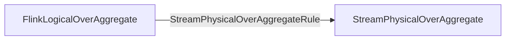
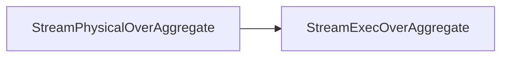

## Required Change Log Mode
- required `ModifyKindSetTrait` - INSERT_ONLY
- required `UpdateKindTrait` - NONE
## Provided Change Log Mode
- produce INSERT_ONLY messages
## Required Ordering

> [!ascending - 必须是升序]
> Exception in thread "main" org.apache.flink.table.api.TableException: The window can only be ordered in ASCENDING mode.

> [!排序字段必须是时间属性]
> Exception in thread "main" org.apache.flink.table.api.TableException: OVER windows' ordering in stream mode must be defined on a time attribute.

## Required Range Definitions

> [!Flink only supports `CURRENT ROW` as the upper boundary]

---
## Logic & Physical Plan
### StreamExecOverAggregate
- Physical Logical Optimized

- Transform to Exec Plan

---
## 核心逻辑
#### StreamExecOverAggregate
- create process function
```Java
final KeyedProcessFunction<RowData, RowData, RowData> overProcessFunction;
if (group.getLowerBound().isPreceding()  
        && group.getLowerBound().isUnbounded()  
        && group.getUpperBound().isCurrentRow()) {  
    // unbounded OVER window  
    overProcessFunction =  
            createUnboundedOverProcessFunction(  
                    ctx,  
                    group.getAggCalls(),  
                    constants,  
                    aggInputRowType,  
                    inputRowType,  
                    rowTimeIdx,  
                    group.isRows(),  
                    config,  
                    planner.createRelBuilder(),  
                    planner.getTypeFactory());  
} else if (group.getLowerBound().isPreceding()  
        && !group.getLowerBound().isUnbounded()  
        && group.getUpperBound().isCurrentRow()) {  
    final Object boundValue =  
            OverAggregateUtil.getBoundary(overSpec, group.getLowerBound());  
  
    if (boundValue instanceof BigDecimal) {  
        throw new TableException(  
                "the specific value is decimal which haven not supported yet.");  
    }  
    // bounded OVER window  
    final long precedingOffset = -1 * (long) boundValue + (group.isRows() ? 1 : 0);  
    overProcessFunction =  
            createBoundedOverProcessFunction(  
                    ctx,  
                    group.getAggCalls(),  
                    constants,  
                    aggInputRowType,  
                    inputRowType,  
                    rowTimeIdx,  
                    group.isRows(),  
                    precedingOffset,  
                    config,  
                    planner.createRelBuilder(),  
                    planner.getTypeFactory());  
} else {  
    throw new TableException("OVER RANGE FOLLOWING windows are not supported yet.");  
}
```

- create keyed process operator
```Java
final KeyedProcessOperator<RowData, RowData, RowData> operator =  
        new KeyedProcessOperator<>(overProcessFunction);
```
### Bounded
- create an ProcessFunction for ROWS clause bounded OVER window to evaluate final aggregate value.
```Java
// event time
if (rowTimeIdx >= 0) {  
    if (isRowsClause) {  
        return new RowTimeRowsBoundedPrecedingFunction<>(  
                config.getStateRetentionTime(),  
                TableConfigUtils.getMaxIdleStateRetentionTime(config),  
                genAggsHandler,  
                flattenAccTypes,  
                fieldTypes,  
                precedingOffset,  
                rowTimeIdx);  
    } else {  
        return new RowTimeRangeBoundedPrecedingFunction<>(  
                genAggsHandler, flattenAccTypes, fieldTypes, precedingOffset, rowTimeIdx);  
    } 
// processing time 
} else {  
    if (isRowsClause) {  
        return new ProcTimeRowsBoundedPrecedingFunction<>(  
                config.getStateRetentionTime(),  
                TableConfigUtils.getMaxIdleStateRetentionTime(config),  
                genAggsHandler,  
                flattenAccTypes,  
                fieldTypes,  
                precedingOffset);  
    } else {  
        return new ProcTimeRangeBoundedPrecedingFunction<>(  
                genAggsHandler, flattenAccTypes, fieldTypes, precedingOffset);  
    }  
}
```
#### Event Time

##### Range
> [!processElement调用链路]
> KeyedProcessOperator.processElement() -> RowTimeRangeBoundedPrecedingFunction.processElement()

`RowTimeRangeBoundedPrecedingFunction几个重要的实例变量，都与state相关
```Java
// the state which keeps the last triggering timestamp 
// 上一次trigger的timestamp,也就是最新触发的timer时间戳
private transient ValueState<Long> lastTriggeringTsState;  
  
// the state which used to materialize the accumulator for incremental calculation
// 聚合结果
private transient ValueState<RowData> accState;  
  
// the state which keeps the safe timestamp to cleanup states
// state的清理时间，用来注册state清理的timer
private transient ValueState<Long> cleanupTsState;  
  
// the state which keeps all the data that are not expired.  
// The first element (as the mapState key) of the tuple is the time stamp. Per each time stamp,  
// the second element of tuple is a list that contains the entire data of all the rows belonging  
// to this time stamp. 
// 同一时间戳下的所有数(同一个key)
private transient MapState<Long, List<RowData>> inputState;
```
`RowTimeRangeBoundedPrecedingFunction.processElement()`
```Java
public void processElement(  
        RowData input,  
        KeyedProcessFunction<K, RowData, RowData>.Context ctx,  
        Collector<RowData> out)  
        throws Exception {  
    // triggering timestamp for trigger calculation 
    // 每一条数据来都需要获取即将trigger的timer时间戳，用来注册timer
    long triggeringTs = input.getLong(rowTimeIdx);  
  
    Long lastTriggeringTs = lastTriggeringTsState.value();  
    if (lastTriggeringTs == null) {  
        lastTriggeringTs = 0L;  
    }  
    // check if the data is expired, if not, save the data and register event time timer 
    // 这里用来判断late event, watermark会使timer触发，进而会更新lastTriggeringTs，可以参考下面的onTimer方法
    if (triggeringTs > lastTriggeringTs) {  
        List<RowData> data = inputState.get(triggeringTs);  
        if (null != data) {  
            data.add(input);  
            inputState.put(triggeringTs, data);  
        } else {  
            data = new ArrayList<RowData>();  
            data.add(input);  
            inputState.put(triggeringTs, data);  
            // register event time timer
            // 注册timer，用来触发onEventTime方法，进而执行下面的onTimer方法  
            ctx.timerService().registerEventTimeTimer(triggeringTs);  
        }
        // 注册state清理timer  
        registerCleanupTimer(ctx, triggeringTs);  
    } else {  
        numLateRecordsDropped.inc();  
    }}
```

`RowTimeRangeBoundedPrecedingFunction.registerCleanupTimer()`
```Java
private void registerCleanupTimer(  
        KeyedProcessFunction<K, RowData, RowData>.Context ctx, long timestamp)  
        throws Exception {  
    // calculate safe timestamp to cleanup states
    // 保留1.5个bound value大小的state窗口，会随着新数据的到来，不断更新，类似一个滑动窗口  
    long minCleanupTimestamp = timestamp + precedingOffset + 1;  
    long maxCleanupTimestamp = timestamp + (long) (precedingOffset * 1.5) + 1;  
    // update timestamp and register timer if needed  
    Long curCleanupTimestamp = cleanupTsState.value();
    // 随着数据的不断到来，minCleanupTimestamp会不断接近curCleanupTimestamp，所以要重新注册新的timer，防止状态丢失  
    if (curCleanupTimestamp == null || curCleanupTimestamp < minCleanupTimestamp) {  
        // we don't delete existing timer since it may delete timer for data processing  
        // TODO Use timer with namespace to distinguish timers
        // 这里不能像unbounded一样删除timer，因为可能会删除处理数据的timer，都是event timer，存储在同一个队列中 
        ctx.timerService().registerEventTimeTimer(maxCleanupTimestamp);  
        cleanupTsState.update(maxCleanupTimestamp);  
    }}
```

> [!onEventTime调用链路]
> KeyedProcessOperator.onEventTime() -> KeyedProcessOperator.invokeUserFunction() -> RowTimeRangeBoundedPrecedingFunction.onTimer()

`RowTimeRangeBoundedPrecedingFunction.onTimer()`
```Java
public void onTimer(  
        long timestamp,  
        KeyedProcessFunction<K, RowData, RowData>.OnTimerContext ctx,  
        Collector<RowData> out)  
        throws Exception {  
    Long cleanupTimestamp = cleanupTsState.value();  
    // if cleanupTsState has not been updated then it is safe to cleanup states 
    // 这个方法目前感觉永远走不到，打个问号？个人认为event timer是watermark驱动的，
    // 如果cleanupTimestamp不更新，也就意味着minCleanupTimestamp永远不会接近maxCleanupTimestamp
    // 那就意味着两种情况发生了，要么都是late event，要么数据乱序严重，导致watermark推进很慢，虽然会触发onTimer方法，但是cleanupTimestamp不会小于timestamp
    // 如果cleanupTimestamp小于timestamp，timestamp变大了，意味着watermark推进了，那cleanupTimestamp也会更新的
    if (cleanupTimestamp != null && cleanupTimestamp <= timestamp) {  
        inputState.clear();  
        accState.clear();  
        lastTriggeringTsState.clear();  
        cleanupTsState.clear();  
        function.cleanup();  
        return;  
    }  
    // gets all window data from state for the calculation  
    List<RowData> inputs = inputState.get(timestamp);  
  
    if (null != inputs) {  
  
        int dataListIndex = 0;  
        RowData accumulators = accState.value();  
  
        // initialize when first run or failover recovery per key  
        if (null == accumulators) {  
            accumulators = function.createAccumulators();  
        }  
        // set accumulators in context first  
        function.setAccumulators(accumulators);  
  
        // keep up timestamps of retract data  
        List<Long> retractTsList = new ArrayList<Long>();  
  
        // do retraction
        // 这里是为了找到bound window以外的数据，将这些数据从state中删除，并且调用聚合函数的retract方法，做减法  
        Iterator<Long> dataTimestampIt = inputState.keys().iterator();  
        while (dataTimestampIt.hasNext()) {  
            Long dataTs = dataTimestampIt.next();
            // 找到state里面bound以外的数据  
            Long offset = timestamp - dataTs;  
            if (offset > precedingOffset) {  
                List<RowData> retractDataList = inputState.get(dataTs);  
                if (retractDataList != null) {  
                    dataListIndex = 0;  
                    while (dataListIndex < retractDataList.size()) {  
                        RowData retractRow = retractDataList.get(dataListIndex);  
                        function.retract(retractRow);  
                        dataListIndex += 1;  
                    }  
                    retractTsList.add(dataTs);  
                } else {  
                    // Does not retract values which are outside of window if the state is  
                    // cleared already.                    
                    LOG.warn(  
                            "The state is cleared because of state ttl. "  
                                    + "This will result in incorrect result. "  
                                    + "You can increase the state ttl to avoid this.");  
                }  
            }  
        }  
  
        // do accumulation  
        dataListIndex = 0;  
        while (dataListIndex < inputs.size()) {  
            RowData curRow = inputs.get(dataListIndex);  
            // accumulate current row  
            function.accumulate(curRow);  
            dataListIndex += 1;  
        }  
  
        // get aggregate result  
        RowData aggValue = function.getValue();  
  
        // copy forwarded fields to output row and emit output row  
        dataListIndex = 0;  
        while (dataListIndex < inputs.size()) {  
            RowData curRow = inputs.get(dataListIndex);  
            output.replace(curRow, aggValue);  
            out.collect(output);  
            dataListIndex += 1;  
        }  
  
        // remove the data that has been retracted
        // 删除state里面做过减法的(retracted)的数据  
        dataListIndex = 0;  
        while (dataListIndex < retractTsList.size()) {  
            inputState.remove(retractTsList.get(dataListIndex));  
            dataListIndex += 1;  
        }  
  
        // update the value of accumulators for future incremental computation  
        accumulators = function.getAccumulators();  
        accState.update(accumulators);  
    }
    // 更新上一次trigger的时间戳    
    lastTriggeringTsState.update(timestamp);  
}
```
##### Row
> [!processElement调用链路]
> KeyedProcessOperator.processElement() -> RowTimeRowsBoundedPrecedingFunction.processElement()

`RowTimeRowsBoundedPrecedingFunction几个重要的实例变量，都与state相关`
```Java
// the state which keeps the last triggering timestamp  
private transient ValueState<Long> lastTriggeringTsState;  
  
// the state which keeps the count of data
// 存储当前bound window的event个数
private transient ValueState<Long> counterState;  
  
// the state which used to materialize the accumulator for incremental calculation  
private transient ValueState<RowData> accState;  
  
// the state which keeps all the data that are not expired.  
// The first element (as the mapState key) of the tuple is the time stamp. Per each time stamp,  
// the second element of tuple is a list that contains the entire data of all the rows belonging  
// to this time stamp.  
private transient MapState<Long, List<RowData>> inputState;
```

`RowTimeRowsBoundedPrecedingFunction.processElement()`
```Java
public void processElement(  
        RowData input,  
        KeyedProcessFunction<K, RowData, RowData>.Context ctx,  
        Collector<RowData> out)  
        throws Exception {  
    // register state-cleanup timer
    // 注意这里是processing timer  
    registerProcessingCleanupTimer(ctx, ctx.timerService().currentProcessingTime());  
  
    // triggering timestamp for trigger calculation  
    long triggeringTs = input.getLong(rowTimeIdx);  
  
    Long lastTriggeringTs = lastTriggeringTsState.value();  
    if (lastTriggeringTs == null) {  
        lastTriggeringTs = 0L;  
    }  
    // check if the data is expired, if not, save the data and register event time timer  
    if (triggeringTs > lastTriggeringTs) {  
        List<RowData> data = inputState.get(triggeringTs);  
        if (null != data) {  
            data.add(input);  
            inputState.put(triggeringTs, data);  
        } else {  
            data = new ArrayList<RowData>();  
            data.add(input);  
            inputState.put(triggeringTs, data);  
            // register event time timer  
            ctx.timerService().registerEventTimeTimer(triggeringTs);  
        }  
    } else {  
        numLateRecordsDropped.inc();  
    }}
```

`KeyedProcessFunctionWithCleanupState.registerProcessingCleanupTimer()`
```Java
protected void registerProcessingCleanupTimer(Context ctx, long currentTime) throws Exception {  
    if (stateCleaningEnabled) {  
        registerProcessingCleanupTimer(  
                cleanupTimeState,  
                currentTime,  
                minRetentionTime,  
                maxRetentionTime,  
                ctx.timerService());  
    }}
```

`CleanupState.registerProcessingCleanupTimer()`
```Java
default void registerProcessingCleanupTimer(  
        ValueState<Long> cleanupTimeState,  
        long currentTime,  
        long minRetentionTime,  
        long maxRetentionTime,  
        TimerService timerService)  
        throws Exception {  
  
    // last registered timer  
    Long curCleanupTime = cleanupTimeState.value();  
  
    // check if a cleanup timer is registered and  
    // that the current cleanup timer won't delete state we need to keep
    // 这里和bound range不一样，用的是时间窗口，和我们自己的配置有关，并且是处理时间    
    if (curCleanupTime == null || (currentTime + minRetentionTime) > curCleanupTime) {  
        // we need to register a new (later) timer  
        long cleanupTime = currentTime + maxRetentionTime;  
        // register timer and remember clean-up time  
        timerService.registerProcessingTimeTimer(cleanupTime);  
        // delete expired timer
        // 这里可以删除，是因为数据处理用的是event timer，这里是processing timer  
        if (curCleanupTime != null) {  
            timerService.deleteProcessingTimeTimer(curCleanupTime);  
        }  
        cleanupTimeState.update(cleanupTime);  
    }}
```

> [!onEventTime调用链路]
> KeyedProcessOperator.onEventTime() -> KeyedProcessOperator.invokeUserFunction() -> RowTimeRowsBoundedPrecedingFunction.onTimer()

`RowTimeRowsBoundedPrecedingFunction.onTimer()`
```Java
public void onTimer(  
        long timestamp,  
        KeyedProcessFunction<K, RowData, RowData>.OnTimerContext ctx,  
        Collector<RowData> out)  
        throws Exception { 
    // 判断是state清理timer还是数据处理timer 
    if (isProcessingTimeTimer(ctx)) {  
        if (stateCleaningEnabled) {  
  
            Iterator<Long> keysIt = inputState.keys().iterator();  
            Long lastProcessedTime = lastTriggeringTsState.value();  
            if (lastProcessedTime == null) {  
                lastProcessedTime = 0L;  
            }  
  
            // is data left which has not been processed yet?  
            boolean noRecordsToProcess = true;
            // state里面可能有些数据还没有fire，因为watermark还没有推进
            while (keysIt.hasNext() && noRecordsToProcess) {  
                if (keysIt.next() > lastProcessedTime) {  
                    noRecordsToProcess = false;  
                }  
            }  
            
            if (noRecordsToProcess) {  
                // We clean the state  
                cleanupState(inputState, accState, counterState, lastTriggeringTsState);  
                function.cleanup();  
            } else {  
                /* 
                 * There are records left to process because a watermark has not been received  
                 * yet.This would only happen if the input stream has stopped. So we don't need to                   * clean up. We leave the state as it is and schedule a new cleanup timer 
                 */
                 // 所以这里保留state，注册新的processing timer，防止state被清理
                 registerProcessingCleanupTimer(ctx, ctx.timerService().currentProcessingTime());  
            }  
        }  
        return;  
    }  
    // gets all window data from state for the calculation  
    List<RowData> inputs = inputState.get(timestamp);  
  
    if (null != inputs) {  
  
        Long dataCount = counterState.value();  
        if (dataCount == null) {  
            dataCount = 0L;  
        }  
  
        RowData accumulators = accState.value();  
        if (accumulators == null) {  
            accumulators = function.createAccumulators();  
        }  
        // set accumulators in context first  
        function.setAccumulators(accumulators);  
  
        List<RowData> retractList = null;  
        long retractTs = Long.MAX_VALUE;  
        int retractCnt = 0;  
        int i = 0;  

		// 循环次数取决于有几条相同timestamp的数据(本次watermark触发的timer时间戳)
        while (i < inputs.size()) {  
            RowData input = inputs.get(i);  
            RowData retractRow = null;
            // 这里有一个疑问，Flink官方文档描述：大概意思就是11条数据参与计算，但是源码中貌似只有10条数据参与计算
            /* A `ROWS` interval is a count-based interval. It defines exactly how many rows are                 * included in the aggregate. The following `ROWS` interval defines that the 10 rows                 * preceding the current row and the current row (so 11 rows in total) are included in               * the aggregate.
             * ROWS BETWEEN 10 PRECEDING AND CURRENT ROW WINDOW
             */ 
            if (dataCount >= precedingOffset) {  
                if (null == retractList) {  
                    // find the smallest timestamp 
                    // 找bound window意外的数据 
                    retractTs = Long.MAX_VALUE;  
                    for (Long dataTs : inputState.keys()) {  
                        if (dataTs < retractTs) {  
                            retractTs = dataTs;  
                            // get the oldest rows to retract them  
                            retractList = inputState.get(dataTs);  
                        }                    }  
                }  
  
                if (retractList != null) {  
                    retractRow = retractList.get(retractCnt);  
                    retractCnt += 1;  
  
                    // remove retracted values from state
                    // 如果这个timesatmp对应的数据刚好和bound window以外的数据量一样,就可以从state中remove了 
                    if (retractList.size() == retractCnt) {  
                        inputState.remove(retractTs);  
                        retractList = null;  
                        retractCnt = 0;  
                    }  
                }  
            } else {  
                dataCount += 1;  
            }  
  
            // retract old row from accumulators  
            if (null != retractRow) {  
                function.retract(retractRow);  
            }  
  
            // accumulate current row  
            function.accumulate(input);  
  
            // prepare output row  
            output.replace(input, function.getValue());  
            out.collect(output);  
  
            i += 1;  
        }  
  
        // update all states
        // 只删除部分数据  
        if (inputState.contains(retractTs)) {  
            if (retractCnt > 0) {  
                retractList.subList(0, retractCnt).clear();  
                inputState.put(retractTs, retractList);  
            }  
        }  
        counterState.update(dataCount);  
        // update the value of accumulators for future incremental computation  
        accumulators = function.getAccumulators();  
        accState.update(accumulators);  
    }  
    lastTriggeringTsState.update(timestamp);  
  
    // update cleanup timer  
    registerProcessingCleanupTimer(ctx, ctx.timerService().currentProcessingTime());  
}
```
#### Processing Time

##### Range
> [!`processElement`调用链路]
> KeyedProcessOperator.processElement() -> ProcTimeRangeBoundedPrecedingFunction.processElement()

`ProcTimeRangeBoundedPrecedingFunction几个重要的实例变量，都与state相关`
```Java
private transient ValueState<RowData> accState;  
private transient MapState<Long, List<RowData>> inputState;  
  
// the state which keeps the safe timestamp to cleanup states  
private transient ValueState<Long> cleanupTsState;
```

`ProcTimeRangeBoundedPrecedingFunction.processElement()`
```Java
public void processElement(  
        RowData input,  
        KeyedProcessFunction<K, RowData, RowData>.Context ctx,  
        Collector<RowData> out)  
        throws Exception {  
    long currentTime = ctx.timerService().currentProcessingTime();  
    // buffer the event incoming event  
  
    // add current element to the window list of elements with corresponding timestamp    
    List<RowData> rowList = inputState.get(currentTime);  
    // null value means that this is the first event received for this timestamp  
    if (rowList == null) {  
        rowList = new ArrayList<RowData>();  
        // register timer to process event once the current millisecond passed  
        ctx.timerService().registerProcessingTimeTimer(currentTime + 1);
        // 这里也是processing timer  
        registerCleanupTimer(ctx, currentTime);  
    }    
    rowList.add(input);  
    inputState.put(currentTime, rowList);  
}
```

`ProcTimeRangeBoundedPrecedingFunction.registerCleanupTimer()`
```Java
private void registerCleanupTimer(  
        KeyedProcessFunction<K, RowData, RowData>.Context ctx, long timestamp)  
        throws Exception {  
    // calculate safe timestamp to cleanup states  
    long minCleanupTimestamp = timestamp + precedingTimeBoundary + 1;  
    long maxCleanupTimestamp = timestamp + (long) (precedingTimeBoundary * 1.5) + 1;  
    // update timestamp and register timer if needed  
    Long curCleanupTimestamp = cleanupTsState.value();  
    if (curCleanupTimestamp == null || curCleanupTimestamp < minCleanupTimestamp) {  
        // we don't delete existing timer since it may delete timer for data processing  
        // TODO Use timer with namespace to distinguish timers 
        // 这里也不可以删除timer，防止删了处理数据的timer，因为都是processing timer 
        ctx.timerService().registerProcessingTimeTimer(maxCleanupTimestamp);  
        cleanupTsState.update(maxCleanupTimestamp);  
    }}
```

> [!onProcessingTime调用链路]
> KeyedProcessOperator.onProcessingTime() -> KeyedProcessOperator.invokeUserFunction() -> ProcTimeRangeBoundedPrecedingFunction.onTimer()

`ProcTimeRangeBoundedPrecedingFunction.onTimer()`
```Java
public void onTimer(  
        long timestamp,  
        KeyedProcessFunction<K, RowData, RowData>.OnTimerContext ctx,  
        Collector<RowData> out)  
        throws Exception {  
    Long cleanupTimestamp = cleanupTsState.value();  
    // if cleanupTsState has not been updated then it is safe to cleanup states  
    // 这里可能执行到，因为有可能上游没有数据了，但又是processing timer，timestamp会不断更新
    if (cleanupTimestamp != null && cleanupTimestamp <= timestamp) {  
        inputState.clear();  
        accState.clear();  
        cleanupTsState.clear();  
        function.cleanup();  
        return;  
    }  
    // remove timestamp set outside of ProcessFunction.  
    ((TimestampedCollector) out).eraseTimestamp();  
  
    // we consider the original timestamp of events  
    // that have registered this time trigger 1 ms ago  
    long currentTime = timestamp - 1;  
  
    // get the list of elements of current proctime  
    List<RowData> currentElements = inputState.get(currentTime);  
  
    // Expired clean-up timers pass the needToCleanupState check.  
    // Perform a null check to verify that we have data to process.    
    if (null == currentElements) {  
        return;  
    }  
    // initialize the accumulators  
    RowData accumulators = accState.value();  
  
    if (null == accumulators) {  
        accumulators = function.createAccumulators();  
    }  
    // set accumulators in context first  
    function.setAccumulators(accumulators);  
  
    // update the elements to be removed and retract them from aggregators 
    // 找到bound window以外的数据timestamp的上界，也就是早于这个时间的数据都要删 
    long limit = currentTime - precedingTimeBoundary;  
  
    // we iterate through all elements in the window buffer based on timestamp keys  
    // when we find timestamps that are out of interest, we retrieve corresponding elements    
    // and eliminate them. Multiple elements could have been received at the same timestamp    
	// the removal of old elements happens only once per proctime as onTimer is called only once    
	Iterator<Long> iter = inputState.keys().iterator();  
    List<Long> markToRemove = new ArrayList<Long>();  
    while (iter.hasNext()) {  
        Long elementKey = iter.next(); 
        // 判断是不是bound window以外的数据 
        if (elementKey < limit) {  
            // element key outside of window. Retract values  
            List<RowData> elementsRemove = inputState.get(elementKey);  
            if (elementsRemove != null) {  
                int iRemove = 0;  
                while (iRemove < elementsRemove.size()) {  
                    RowData retractRow = elementsRemove.get(iRemove);  
                    function.retract(retractRow);  
                    iRemove += 1;  
                }  
            } else {  
                // Does not retract values which are outside of window if the state is cleared  
                // already.                
                LOG.warn(  
                        "The state is cleared because of state ttl. "  
                                + "This will result in incorrect result. "  
                                + "You can increase the state ttl to avoid this.");  
            }  
  
            // mark element for later removal not to modify the iterator over MapState  
            markToRemove.add(elementKey);  
        }  
    }  
  
    // need to remove in 2 steps not to have concurrent access errors via iterator to the  
    // MapState    
    int i = 0;  
    while (i < markToRemove.size()) {
        // 删除被做减法的数据  
        inputState.remove(markToRemove.get(i));  
        i += 1;  
    }  
    // add current elements to aggregator. Multiple elements might  
    // have arrived in the same proctime    
    // the same accumulator value will be computed for all elements    
    int iElemenets = 0;  
    while (iElemenets < currentElements.size()) {  
        RowData input = currentElements.get(iElemenets);  
        function.accumulate(input);  
        iElemenets += 1;  
    }  
    // we need to build the output and emit for every event received at this proctime  
    iElemenets = 0;  
    RowData aggValue = function.getValue();  
    while (iElemenets < currentElements.size()) {  
        RowData input = currentElements.get(iElemenets);  
        output.replace(input, aggValue);  
        out.collect(output);  
        iElemenets += 1;  
    }  
    // update the value of accumulators for future incremental computation  
    accumulators = function.getAccumulators();  
    accState.update(accumulators);  
}
```
##### Row
> [!`processElement`调用链路]
> KeyedProcessOperator.processElement() -> ProcTimeRowsBoundedPrecedingFunction.processElement()

`ProcTimeRowsBoundedPrecedingFunction几个重要的实例变量，都与state相关`
```Java
private transient ValueState<RowData> accState;  
private transient MapState<Long, List<RowData>> inputState;
// 当前bound window的数据量
private transient ValueState<Long> counterState;
// 当前bound window的最小timestamp
private transient ValueState<Long> smallestTsState;
```

`ProcTimeRowsBoundedPrecedingFunction.processElement()`
```Java
public void processElement(  
        RowData input,  
        KeyedProcessFunction<K, RowData, RowData>.Context ctx,  
        Collector<RowData> out)  
        throws Exception {  
    long currentTime = ctx.timerService().currentProcessingTime();  
    // register state-cleanup timer  
    registerProcessingCleanupTimer(ctx, currentTime);  
  
    // initialize state for the processed element  
    RowData accumulators = accState.value();  
    if (accumulators == null) {  
        accumulators = function.createAccumulators();  
    }    
    // set accumulators in context first  
    function.setAccumulators(accumulators);  
  
    // get smallest timestamp 
    Long smallestTs = smallestTsState.value();  
    if (smallestTs == null) {
    // 没找到，说明第一次来数据   
        smallestTs = currentTime;  
        smallestTsState.update(smallestTs);  
    }    
    
    // get previous counter value  
    Long counter = counterState.value();  
    if (counter == null) {  
        counter = 0L;  
    }  
    if (counter == precedingOffset) {
        // 找到最小timestamp的数据  
        List<RowData> retractList = inputState.get(smallestTs);  
        if (retractList != null) {  
            // get oldest element beyond buffer size  
            // and if oldest element exist, retract value            
            RowData retractRow = retractList.get(0);  
            function.retract(retractRow);  
            retractList.remove(0);  
        } else {  
            // Does not retract values which are outside of window if the state is cleared  
            // already.            
            LOG.warn(  
                    "The state is cleared because of state ttl. "  
                            + "This will result in incorrect result. "  
                            + "You can increase the state ttl to avoid this.");  
        }  
        // if reference timestamp list not empty, keep the list
        // 删掉部分最小时间戳的数据  
        if (retractList != null && !retractList.isEmpty()) {  
            inputState.put(smallestTs, retractList);  
        } 
        // if smallest timestamp list is empty, remove and find new smallest  
        else {
	        // 最小时间戳的数据量刚好被删完了  
            inputState.remove(smallestTs);  
            Iterator<Long> iter = inputState.keys().iterator();  
            long currentTs = 0L;  
            long newSmallestTs = Long.MAX_VALUE;  
            while (iter.hasNext()) {  
                currentTs = iter.next();  
                if (currentTs < newSmallestTs) {
                    // 寻找下一个最小时间戳  
                    newSmallestTs = currentTs;  
                }  
            }  
            smallestTsState.update(newSmallestTs);  
        }  
    } // we update the counter only while buffer is getting filled  
    else {  
        counter += 1;  
        counterState.update(counter);  
    }  
    // update map state, counter and timestamp  
    List<RowData> currentTimeState = inputState.get(currentTime);  
    if (currentTimeState != null) {  
        currentTimeState.add(input);  
        inputState.put(currentTime, currentTimeState);  
    } else { // add new input  
        List<RowData> newList = new ArrayList<RowData>();  
        newList.add(input);  
        inputState.put(currentTime, newList);  
    }  
    // accumulate current row  
    function.accumulate(input);  
    // update the value of accumulators for future incremental computation  
    accumulators = function.getAccumulators();  
    accState.update(accumulators);  
  
    // prepare output row  
    RowData aggValue = function.getValue();  
    output.replace(input, aggValue);  
    out.collect(output);  
}
```

> [!onProcessingTime调用链路]
> KeyedProcessOperator.onProcessingTime() -> KeyedProcessOperator.invokeUserFunction() -> ProcTimeRangeBoundedPrecedingFunction.onTimer()

`ProcTimeRangeBoundedPrecedingFunction.onTimer()`
```Java
public void onTimer(  
        long timestamp,  
        KeyedProcessFunction<K, RowData, RowData>.OnTimerContext ctx,  
        Collector<RowData> out)  
        throws Exception {  
    if (stateCleaningEnabled) {  
        cleanupState(inputState, accState, counterState, smallestTsState);  
        function.cleanup();  
    }}
```
### UnBounded
- create an ProcessFunction for unbounded OVER window to evaluate final aggregate value. 
```Java
// event time
if (rowTimeIdx >= 0) {  
    if (isRowsClause) {  
        // ROWS unbounded over process function  
        return new RowTimeRowsUnboundedPrecedingFunction<>(  
                config.getStateRetentionTime(),  
                TableConfigUtils.getMaxIdleStateRetentionTime(config),  
                genAggsHandler,  
                flattenAccTypes,  
                fieldTypes,  
                rowTimeIdx);  
    } else {  
        // RANGE unbounded over process function  
        return new RowTimeRangeUnboundedPrecedingFunction<>(  
                config.getStateRetentionTime(),  
                TableConfigUtils.getMaxIdleStateRetentionTime(config),  
                genAggsHandler,  
                flattenAccTypes,  
                fieldTypes,  
                rowTimeIdx);  
    }  
// processing time
} else {  
    return new ProcTimeUnboundedPrecedingFunction<>(  
            config.getStateRetentionTime(),  
            TableConfigUtils.getMaxIdleStateRetentionTime(config),  
            genAggsHandler,  
            flattenAccTypes);  
}
```
#### Event Time

##### Range
> [!onEventTime调用链路]
> KeyedProcessOperator.onEventTime() -> KeyedProcessOperator.invokeUserFunction() -> AbstractRowTimeUnboundedPrecedingOver.onTimer() -> RowTimeRangeUnboundedPrecedingFunction.processElementsWithSameTimestamp()

`RowTimeRangeUnboundedPrecedingFunction.processElementsWithSameTimestamp()`
```Java
public void processElementsWithSameTimestamp(List<RowData> curRowList, Collector<RowData> out)  
        throws Exception {  
    int i = 0;  
    // all same timestamp data should have same aggregation value.
    // 由于是range interval，Flink会基于排序的时间字段作为interval,所以相同的时间戳聚合值一样
    while (i < curRowList.size()) {  
        RowData curRow = curRowList.get(i);  
        function.accumulate(curRow);  
        i += 1;  
    }  
    // emit output row  
    i = 0;  
    RowData aggValue = function.getValue();  
    while (i < curRowList.size()) {  
        RowData curRow = curRowList.get(i);  
        // prepare output row  
        output.replace(curRow, aggValue);  
        out.collect(output);  
        i += 1;  
    }}
```
##### Row
> [!processElement调用链路]
> KeyedProcessOperator.processElement() -> AbstractRowTimeUnboundedPrecedingOver.processElement()

`AbstractRowTimeUnboundedPrecedingOver.processElement()`
```Java
public void processElement(  
        RowData input,  
        KeyedProcessFunction<K, RowData, RowData>.Context ctx,  
        Collector<RowData> out)  
        throws Exception {  
    // register state-cleanup timer  
    registerProcessingCleanupTimer(ctx, ctx.timerService().currentProcessingTime());  
  
    long timestamp = input.getLong(rowTimeIdx);  
    long curWatermark = ctx.timerService().currentWatermark();  
	 // 排除late event
    if (timestamp > curWatermark) {  
        // ensure every key just registers one timer  
        // default watermark is Long.Min, avoid overflow we use zero when watermark < 0        
        long triggerTs = curWatermark < 0 ? 0 : curWatermark + 1;  
        ctx.timerService().registerEventTimeTimer(triggerTs);  
  
        // put row into state  
        List<RowData> rowList = inputState.get(timestamp);  
        if (rowList == null) {  
            rowList = new ArrayList<RowData>();  
        }  
        rowList.add(input);  
        inputState.put(timestamp, rowList);  
    } else {  
        // discard late record  
        numLateRecordsDropped.inc();  
    }}
```

> [!onEventTime调用链路]
> KeyedProcessOperator.onEventTime() -> KeyedProcessOperator.invokeUserFunction() -> AbstractRowTimeUnboundedPrecedingOver.onTimer() -> RowTimeRowsUnboundedPrecedingFunction.processElementsWithSameTimestamp()

`AbstractRowTimeUnboundedPrecedingOver.onTimer()`
```Java
public void onTimer(  
        long timestamp,  
        KeyedProcessFunction<K, RowData, RowData>.OnTimerContext ctx,  
        Collector<RowData> out)  
        throws Exception {  
    // TTL都是基于processing timer
    if (isProcessingTimeTimer(ctx)) {  
        if (stateCleaningEnabled) {  
  
            // we check whether there are still records which have not been processed yet  
            if (inputState.isEmpty()) {  
                // we clean the state  
                cleanupState(inputState, accState);  
                function.cleanup();  
            } else {  
            /**
             * There are records left to process because a watermark has not been received yet.                  * This would only happen if the input stream has stopped. So we don't need clean up.                * We leave the state as it is and schedule a new cleanup timer   
             */
             // 为了防止上游没有数据，导致watermrk不推进了，不能清理状态
             registerProcessingCleanupTimer(ctx, ctx.timerService().currentProcessingTime());  
            }  
        }  
        return;  
    }  
    Iterator<Long> keyIterator = inputState.keys().iterator();  
    if (keyIterator.hasNext()) {  
        Long curWatermark = ctx.timerService().currentWatermark();  
        boolean existEarlyRecord = false;  
  
        // sort the record timestamps  
        do {  
            Long recordTime = keyIterator.next();  
            // only take timestamps smaller/equal to the watermark
            // 只处理小于当前watermark的数据  
            if (recordTime <= curWatermark) {  
                insertToSortedList(recordTime);  
            } else {  
            // 这里可能由于上游数据乱序导致的，有些早来的数据不会被处理
                existEarlyRecord = true;  
            }  
        } while (keyIterator.hasNext());  
  
        // get last accumulator  
        RowData lastAccumulator = accState.value();  
        if (lastAccumulator == null) {  
            // initialize accumulator  
            lastAccumulator = function.createAccumulators();  
        }  
        // set accumulator in function context first  
        function.setAccumulators(lastAccumulator);  
  
        // emit the rows in order  
        while (!sortedTimestamps.isEmpty()) {
	        // 遍历获取排过序时间戳  
            Long curTimestamp = sortedTimestamps.removeFirst();  
            List<RowData> curRowList = inputState.get(curTimestamp);  
            if (curRowList != null) {  
                // process the same timestamp datas, the mechanism is different according ROWS  
                // or RANGE
            // 处理相同时间戳的数据               
            processElementsWithSameTimestamp(curRowList, out);  
            } else {  
                // Ignore the same timestamp datas if the state is cleared already.  
                LOG.warn(  
                        "The state is cleared because of state ttl. "  
                                + "This will result in incorrect result. "  
                                + "You can increase the state ttl to avoid this.");  
            } 
            // 已经处理过的数据时间戳可以删掉了
            inputState.remove(curTimestamp);  
        }  
  
        // update acc state  
        lastAccumulator = function.getAccumulators();  
        accState.update(lastAccumulator);  
  
        // if are are rows with timestamp > watermark, register a timer for the next watermark  
        if (existEarlyRecord) {  
            ctx.timerService().registerEventTimeTimer(curWatermark + 1);  
        }  
    }  
  
    // update cleanup timer  
    registerProcessingCleanupTimer(ctx, ctx.timerService().currentProcessingTime());  
}
```

`RowTimeRowsUnboundedPrecedingFunction.processElementsWithSameTimestamp()`
```Java
public void processElementsWithSameTimestamp(List<RowData> curRowList, Collector<RowData> out)  
        throws Exception {  
    int i = 0;  
    while (i < curRowList.size()) {  
        RowData curRow = curRowList.get(i);  
        // accumulate current row  
        function.accumulate(curRow);  
        // prepare output row  
        output.replace(curRow, function.getValue());  
        // emit output row  
        out.collect(output);  
        i += 1;  
    }}
```
#### Processing Time

##### Range & Row
> [!`processElement`调用链路]
> KeyedProcessOperator.processElement() -> ProcTimeUnboundedPrecedingFunction.processElement()

```Java
public void processElement(  
        RowData input,  
        KeyedProcessFunction<K, RowData, RowData>.Context ctx,  
        Collector<RowData> out)  
        throws Exception {  
    // register state-cleanup timer  
    registerProcessingCleanupTimer(ctx, ctx.timerService().currentProcessingTime());  
  
    RowData accumulators = accState.value();  
    if (null == accumulators) {  
        accumulators = function.createAccumulators();  
    }    // set accumulators in context first  
    function.setAccumulators(accumulators);  
  
    // accumulate input row  
    function.accumulate(input);  
  
    // update the value of accumulators for future incremental computation  
    accumulators = function.getAccumulators();  
    accState.update(accumulators);  
  
    // prepare output row  
    RowData aggValue = function.getValue();  
    output.replace(input, aggValue);  
    out.collect(output);  
}
```


> [!onProcessingTime调用链路]
> KeyedProcessOperator.onProcessingTime() -> KeyedProcessOperator.invokeUserFunction() -> ProcTimeUnboundedPrecedingFunction.onTimer()

```Java
public void onTimer(  
        long timestamp,  
        KeyedProcessFunction<K, RowData, RowData>.OnTimerContext ctx,  
        Collector<RowData> out)  
        throws Exception {  
    if (stateCleaningEnabled) {  
        cleanupState(accState);  
        function.cleanup();  
    }}
```
---
## Resources
1. [[Stream SQL Window Example - Regular]]
2. https://zhuanlan.zhihu.com/p/453182051