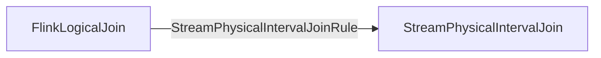
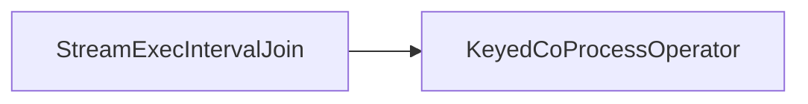
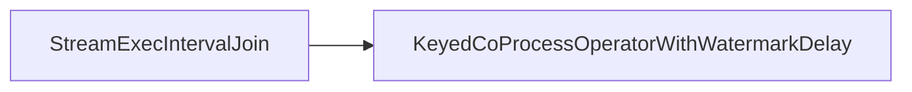

### Logic & Physical Plan & Execution

#### Physical Logical Optimized

#### Transform to Exec Plan

#### Stream Operator
- Processing Time

- Event Time


## Limitation
### StreamPhysicalIntervalJoinRule
```Java
override def matches(call: RelOptRuleCall): Boolean = {  
  val join: FlinkLogicalJoin = call.rel(0)  

  // 满足interval join
  if (!satisfyIntervalJoin(join)) {  
    return false  
  }  
  
  // validate the join  
  val windowBounds = extractWindowBounds(join)._1.get  
  
  if (windowBounds.isEventTime) {  
    val leftTimeAttributeType = join.getLeft.getRowType.getFieldList  
      .get(windowBounds.getLeftTimeIdx)  
      .getType  
    val rightTimeAttributeType = join.getRight.getRowType.getFieldList  
      .get(windowBounds.getRightTimeIdx)  
      .getType  
    if (leftTimeAttributeType.getSqlTypeName != rightTimeAttributeType.getSqlTypeName) {  
    //一定是事件事件属性
      throw new ValidationException(  
        String.format(  
          "Interval join with rowtime attribute requires same rowtime types," +  
            " but the types are %s and %s.",  
          leftTimeAttributeType.toString,  
          rightTimeAttributeType.toString  
        ))  
    }  
  } else {  
    // Check that no event-time attributes are in the input 
    // because the processing time window  
    // join does not correctly hold back watermarks.    
    // We rely on projection pushdown to remove unused attributes before the join.
    val joinRowType = join.getRowType
    // 如果是处理时间，那么interval join的输入不能含有事件时间属性，
    // 因为处理时间不能正确处理watermark  
    val containsRowTime = joinRowType.getFieldList.exists(f => isRowtimeIndicatorType(f.getType))  
    if (containsRowTime) {  
      throw new TableException(  
        "Interval join with proctime attribute requires no event-time attributes are in the " +  
          "join inputs.")  
    }  
  }  
  true  
}
```
## 核心逻辑
### 公共逻辑
#### TimeIntervalJoin
##### processElement1()
```Java

```
##### processElement2()
```Java

```

#### KeyedCoProcessOperator

### Processing Time
#### ProcTimeIntervalJoin
### Event Time
#### RowTimeIntervalJoin

#### KeyedCoProcessOperatorWithWatermarkDelay

## Resources
1. [[Change Log 原理与实现]]
2. [[Stream SQL Interval Join Example]]
3. [[Join Use Case]]