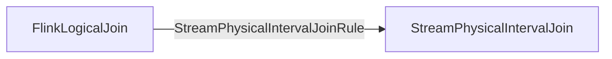
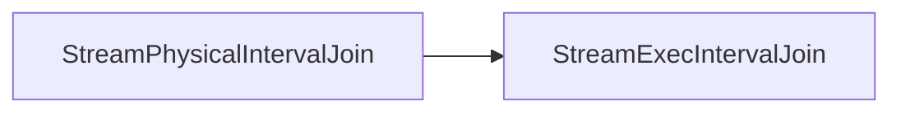
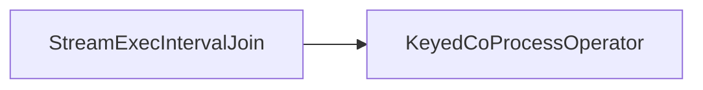
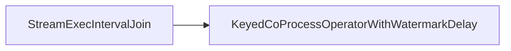

### Required &  Provided Change Log Mode
#### SatisfyModifyKindSetTraitVisitor
```Java
case _: StreamPhysicalTemporalSort | _: StreamPhysicalIntervalJoin |  
    _: StreamPhysicalOverAggregate | _: StreamPhysicalPythonOverAggregate =>  
  // TemporalSort, OverAggregate, IntervalJoin only support consuming insert-only  
  // and producing insert-only changes  
  val children = visitChildren(rel, ModifyKindSetTrait.INSERT_ONLY)  
  createNewNode(rel, children, ModifyKindSetTrait.INSERT_ONLY, requiredTrait, requester)
```
#### SatisfyUpdateKindTraitVisitor
```Java
case _: StreamPhysicalWindowAggregate | _: StreamPhysicalWindowRank |  
    _: StreamPhysicalWindowDeduplicate | _: StreamPhysicalDeduplicate |  
    _: StreamPhysicalTemporalSort | _: StreamPhysicalMatch |  
    _: StreamPhysicalOverAggregate | _: StreamPhysicalIntervalJoin |  
    _: StreamPhysicalPythonOverAggregate | _: StreamPhysicalWindowJoin =>  
  // WindowAggregate, WindowTableAggregate, WindowRank, WindowDeduplicate, Deduplicate,  
  // TemporalSort, CEP, OverAggregate, and IntervalJoin, 
  // WindowJoin require nothing  about UpdateKind.  
  val children = visitChildren(rel, UpdateKindTrait.NONE)  
  createNewNode(rel, children, requiredTrait)
```
### Logic & Physical Plan & Execution

#### Physical Logical Optimized

#### Transform to Exec Plan

#### Stream Operator
- Processing Time

- Event Time


## Limitation
### StreamPhysicalIntervalJoinRule
```Java
override def matches(call: RelOptRuleCall): Boolean = {  
  val join: FlinkLogicalJoin = call.rel(0)  

  // 满足interval join
  if (!satisfyIntervalJoin(join)) {  
    return false  
  }  
  
  // validate the join  
  val windowBounds = extractWindowBounds(join)._1.get  
  
  if (windowBounds.isEventTime) {  
    val leftTimeAttributeType = join.getLeft.getRowType.getFieldList  
      .get(windowBounds.getLeftTimeIdx)  
      .getType  
    val rightTimeAttributeType = join.getRight.getRowType.getFieldList  
      .get(windowBounds.getRightTimeIdx)  
      .getType  
    if (leftTimeAttributeType.getSqlTypeName != rightTimeAttributeType.getSqlTypeName) {  
    //一定是事件时间属性，前提是intervaljoin是事件时间
      throw new ValidationException(  
        String.format(  
          "Interval join with rowtime attribute requires same rowtime types," +  
            " but the types are %s and %s.",  
          leftTimeAttributeType.toString,  
          rightTimeAttributeType.toString  
        ))  
    }  
  } else {  
    // Check that no event-time attributes are in the input 
    // because the processing time window  
    // join does not correctly hold back watermarks.    
    // We rely on projection pushdown to remove unused attributes before the join.
    val joinRowType = join.getRowType
    // 如果是处理时间，那么interval join的输入不能含有事件时间属性，
    // 因为处理时间不能正确处理watermark  
    val containsRowTime = joinRowType.getFieldList.exists(f => isRowtimeIndicatorType(f.getType))  
    if (containsRowTime) {  
      throw new TableException(  
        "Interval join with proctime attribute requires no event-time attributes are in the " +  
          "join inputs.")  
    }  
  }  
  true  
}
```
## 核心逻辑
### 公共逻辑
#### TimeIntervalJoin
##### processElement1() & processElement2()
```Java
public void processElement1(RowData leftRow, Context ctx, Collector<RowData> out)  
        throws Exception {  
    joinFunction.setJoinKey(ctx.getCurrentKey());  
    joinCollector.setInnerCollector(out);
    // 更新operator时间，其实就是拿到最新的watermark(event time)  
    updateOperatorTime(ctx);  
  
    long timeForLeftRow = getTimeForLeftStream(ctx, leftRow);  
    // 获取要查询的数据时间上下界（右表的）  
    long rightQualifiedLowerBound = timeForLeftRow - rightRelativeSize;  
    long rightQualifiedUpperBound = timeForLeftRow + leftRelativeSize;  
    boolean emitted = false;  
  
    // Check if we need to join the current row against cached rows of the right input.  
    // The condition here should be rightMinimumTime < rightQualifiedUpperBound.    
    // We use rightExpirationTime as an approximation of the rightMinimumTime here,    
    // since rightExpirationTime <= rightMinimumTime is always true.    
    // 上一次数据的过期时间是否大于你要查询数据的上界，如果大于，说明你查询的数据已经过期了  
    if (rightExpirationTime < rightQualifiedUpperBound) {  
        // Upper bound of current join window has not 
        // passed the cache expiration time yet.  
        // There might be qualifying rows in the cache that 
        // the current row needs to be joined with.        
        // 计算新的过期时间  
        rightExpirationTime = calExpirationTime(leftOperatorTime, rightRelativeSize);  
        // Join the leftRow with rows from the right cache.  
        Iterator<Map.Entry<Long, List<Tuple2<RowData, Boolean>>>> rightIterator =  
                rightCache.iterator();  
        while (rightIterator.hasNext()) {  
            Map.Entry<Long, List<Tuple2<RowData, Boolean>>> rightEntry = rightIterator.next();  
            Long rightTime = rightEntry.getKey();
            // 满足时间范围的数据  
            if (rightTime >= rightQualifiedLowerBound  
                    && rightTime <= rightQualifiedUpperBound) {  
                List<Tuple2<RowData, Boolean>> rightRows = rightEntry.getValue();  
                boolean entryUpdated = false;  
                for (Tuple2<RowData, Boolean> tuple : rightRows) {  
                    joinCollector.reset();  
                    // 如果join上就发出去，并且设置joinCollector emitted为true (left table)  
                    joinFunction.join(leftRow, tuple.f0, joinCollector);  
                    // 如果join上了，将emitted设为true  
                    emitted = emitted || joinCollector.isEmitted();  
                    if (joinType.isRightOuter()) {  
                        // 以前没join上，现在join上了，标记emitted为true(right table)  
                        if (!tuple.f1 && joinCollector.isEmitted()) {  
                         // Mark the right row as being successfully joined and emitted. 
                            tuple.f1 = true;  
                            entryUpdated = true;  
                        }                    
                    }  
                }  
                if (entryUpdated) {  
                    // Write back the edited entry (mark emitted) for the right cache.  
                    rightEntry.setValue(rightRows);  
                }  
            }  
            // Clean up the expired right cache row, clean the cache while join
// 如果state里面，这条数据时间小于新的过期时间，那么这条数据即将被删除，
// 如果是rightOuterJoin，那么这条数据需要被发出去  
// 随着watermark的推进，timer会被触发，触发的时候会删除过期的数据  
// 这里有一个问号，等于可以不加吗？  
// 有一个好处就是防止一直来expire数据，导致state过大，不可预测
            if (rightTime <= rightExpirationTime) {  
                if (joinType.isRightOuter()) {  
                    List<Tuple2<RowData, Boolean>> rightRows = rightEntry.getValue();  
                    rightRows.forEach(  
                            (Tuple2<RowData, Boolean> tuple) -> {  
                                if (!tuple.f1) {  
    // Emit a null padding result if the right row has never been successfully joined.                                   
			    joinCollector.collect(paddingUtil.padRight(tuple.f0));  
                                }                            
                            });  
                }  
                // eager remove  
                rightIterator.remove();  
            } 
            // We could do the short-cutting optimization here once we get a state with  
            // ordered keys.        
        }  
    }  
    // Check if we need to cache the current row. 
    // rightExpirationTime < rightQualifiedUpperBound 如果这个为false  
	// rightOperatorTime < rightQualifiedUpperBound 这个一定为false  
	// 那么这条数据如果没有被关联上，必然会随着watermark推进被删除
    if (rightOperatorTime < rightQualifiedUpperBound) {  
        // 不管join没join上，都要写到cache里面  
        // Operator time of right stream has not exceeded the upper window bound of the current  
        // row. Put it into the left cache, 
        // since later coming records from the right stream are        
        // expected to be joined with it.        
        List<Tuple2<RowData, Boolean>> leftRowList = leftCache.get(timeForLeftRow);  
        if (leftRowList == null) {  
            leftRowList = new ArrayList<>(1);  
        }  
        leftRowList.add(Tuple2.of(leftRow, emitted));  
        leftCache.put(timeForLeftRow, leftRowList);  
        if (rightTimerState.value() == null) {  
            // Register a timer on the RIGHT stream to remove rows.  
            registerCleanUpTimer(ctx, timeForLeftRow, true);  
        }  
    } else if (!emitted && joinType.isLeftOuter()) { 
// 随着watermark的推进，timer会触发，这条数据即将被删除  
// 这里也有点疑问,为啥要发出去? 这里我觉得可以不发，让右边处理  
// 缺点：但是有一个问题就是，如果不发出去就要保留在state里面，这样会导致state里面的数据越来越多  
// 优点: 发出去了，state不会增加，但是有一个问题是，如果右边来了一条数据，
// 和这条数据join上了，那么这会导致错误结果
        joinCollector.collect(paddingUtil.padLeft(leftRow));  
    }}
```
##### calExpirationTime()
```Java
private long calExpirationTime(long operatorTime, long relativeSize) {  
    if (operatorTime < Long.MAX_VALUE) {  
        return operatorTime - relativeSize - allowedLateness - 1;  
    } else {  
        // When operatorTime = Long.MaxValue, it means the stream has reached the end.  
        return Long.MAX_VALUE;  
    }}
```
##### registerCleanUpTimer()
```Java
private void registerCleanUpTimer(Context ctx, long rowTime, boolean leftRow)  
        throws IOException {  
    if (leftRow) {  
        long cleanUpTime =  
                rowTime + leftRelativeSize + minCleanUpInterval + allowedLateness + 1;  
        registerTimer(ctx, cleanUpTime);  
        rightTimerState.update(cleanUpTime);  
    } else {  
        long cleanUpTime =  
                rowTime + rightRelativeSize + minCleanUpInterval + allowedLateness + 1;  
        registerTimer(ctx, cleanUpTime);  
        leftTimerState.update(cleanUpTime);  
    }}
```
##### onTimer()
```Java
// 这个onTimer基本上清理不到什么数据，在上面已经清理了
public void onTimer(long timestamp, OnTimerContext ctx, Collector<RowData> out)  
        throws Exception {  
    joinFunction.setJoinKey(ctx.getCurrentKey());  
    joinCollector.setInnerCollector(out);  
    updateOperatorTime(ctx);  
    // In the future, we should separate the left and right watermarks. 
    //Otherwise, the registered timer of the faster stream will be delayed, 
    //even if the watermarks have already been emitted by the source.    
    Long leftCleanUpTime = leftTimerState.value();  
    if (leftCleanUpTime != null && timestamp == leftCleanUpTime) {
	    // 计算右表要删除的state数据范围  
        rightExpirationTime = calExpirationTime(leftOperatorTime, rightRelativeSize);  
        removeExpiredRows(  
                joinCollector, rightExpirationTime, rightCache, leftTimerState, ctx, false);  
    }  
    Long rightCleanUpTime = rightTimerState.value();
    // 计算左表要删除的state数据范围  
    if (rightCleanUpTime != null && timestamp == rightCleanUpTime) {  
        leftExpirationTime = calExpirationTime(rightOperatorTime, leftRelativeSize);  
        removeExpiredRows(  
                joinCollector, leftExpirationTime, leftCache, rightTimerState, ctx, true);  
    }}
```
##### removeExpiredRows()
```Java
private void removeExpiredRows(  
        Collector<RowData> collector,  
        long expirationTime,  
        MapState<Long, List<Tuple2<RowData, Boolean>>> rowCache,  
        ValueState<Long> timerState,  
        OnTimerContext ctx,  
        boolean removeLeft)  
        throws Exception {  
    Iterator<Map.Entry<Long, List<Tuple2<RowData, Boolean>>>> iterator = rowCache.iterator();  

	// 记录state里面最小的时间(清理过期数据之后的最小时间)，用来注册新的定时器
    long earliestTimestamp = -1L;  
  
    // We remove all expired keys and do not leave the loop early.  
    // Hence, we do a full pass over the state.    
    while (iterator.hasNext()) {  
        Map.Entry<Long, List<Tuple2<RowData, Boolean>>> entry = iterator.next();  
        Long rowTime = entry.getKey();  
        if (rowTime <= expirationTime) {  
            if (removeLeft && joinType.isLeftOuter()) {  
                List<Tuple2<RowData, Boolean>> rows = entry.getValue();  
                rows.forEach(  
                        (Tuple2<RowData, Boolean> tuple) -> {  
                            if (!tuple.f1) {  
                // Emit a null padding result if the row has never been successfully
                 joined.collector.collect(paddingUtil.padLeft(tuple.f0));  
                            }  
                        });  
            } else if (!removeLeft && joinType.isRightOuter()) {  
                List<Tuple2<RowData, Boolean>> rows = entry.getValue();  
                rows.forEach(  
                        (Tuple2<RowData, Boolean> tuple) -> {  
                            if (!tuple.f1) {  
                // Emit a null padding result if the row has never been successfully 
                joined.collector.collect(paddingUtil.padRight(tuple.f0));  
                            }  
                        });  
            }  
            iterator.remove();  
        } else {  
            // We find the earliest timestamp that is still valid.  
            if (rowTime < earliestTimestamp || earliestTimestamp < 0) {  
                earliestTimestamp = rowTime;  
            }  
        }  
    }  
  
    if (earliestTimestamp > 0) {  
        // There are rows left in the cache. Register a timer to expire them later.  
        registerCleanUpTimer(ctx, earliestTimestamp, removeLeft);  
    } else {  
        // No rows left in the cache. Clear the states and the timerState will be 0.
        // state里面都是过期的数据，全部清理掉  
        timerState.clear();  
        rowCache.clear();  
    }}
```
### Processing Time
#### ProcTimeIntervalJoin
```Java
// 更新operator时间,以供后面计算expiration time
void updateOperatorTime(Context ctx) {  
    leftOperatorTime = ctx.timerService().currentProcessingTime();  
    rightOperatorTime = leftOperatorTime;  
}  
  
// 获取左表数据的时间  
long getTimeForLeftStream(Context ctx, RowData row) {  
    return leftOperatorTime;  
}  
  
// 获取右表数据的时间    
long getTimeForRightStream(Context ctx, RowData row) {  
    return rightOperatorTime;  
}  
  
// 注册定时器，用来清理数据  
void registerTimer(Context ctx, long cleanupTime) {  
    ctx.timerService().registerProcessingTimeTimer(cleanupTime);  
}
```
### Event Time
#### RowTimeIntervalJoin
```Java
/**  
 * Get the maximum interval between receiving a row and emitting it (as part of a joined * result). This is the time interval by which watermarks need to be held back. * * @return the maximum delay for the outputs  
 */
 // 获取watermark最大delay时间
 public long getMaxOutputDelay() {  
    return Math.max(leftRelativeSize, rightRelativeSize) + allowedLateness;  
}  
  
// 更新operator时间  
void updateOperatorTime(Context ctx) {  
    leftOperatorTime =  
            ctx.timerService().currentWatermark() > 0  
                    ? ctx.timerService().currentWatermark()  
                    : 0L;  
    // We may set different operator times in the future.  
    rightOperatorTime = leftOperatorTime;  
}  
  
// 获取左表数据时间  
long getTimeForLeftStream(Context ctx, RowData row) {  
    return row.getLong(leftTimeIdx);  
}  
  
// 获取右边数据时间  
long getTimeForRightStream(Context ctx, RowData row) {  
    return row.getLong(rightTimeIdx);  
}  
  
// 注册定时器，用来清理数据  
void registerTimer(Context ctx, long cleanupTime) {  
    // Maybe we can register timers for different streams in the future.  
    ctx.timerService().registerEventTimeTimer(cleanupTime);  
}
```
#### KeyedCoProcessOperatorWithWatermarkDelay
```Java
// StreamExecIntervalJoin
return ExecNodeUtil.createTwoInputTransformation(  
        leftInputTransform,  
        rightInputTransform,  
        createTransformationMeta(INTERVAL_JOIN_TRANSFORMATION, config),  
        new KeyedCoProcessOperatorWithWatermarkDelay<>(  
                rowJoinFunc, rowJoinFunc.getMaxOutputDelay()),  
        returnTypeInfo,  
        leftInputTransform.getParallelism());

// KeyedCoProcessOperatorWithWatermarkDelay
public KeyedCoProcessOperatorWithWatermarkDelay(  
        KeyedCoProcessFunction<K, IN1, IN2, OUT> flatMapper, long watermarkDelay) {  
    super(flatMapper);  
    Preconditions.checkArgument(  
            watermarkDelay >= 0, "The watermark delay should be non-negative.");  
    if (watermarkDelay == 0) {  
        // emits watermark without delay  
        emitter =  
                (Consumer<Watermark> & Serializable)  
                        (Watermark mark) -> output.emitWatermark(mark);  
    } else {  
        // emits watermark with delay  
        emitter =  
                (Consumer<Watermark> & Serializable)  
                        (Watermark mark) ->  
                                output.emitWatermark(  
                                        new Watermark(mark.getTimestamp() - watermarkDelay));  
    }}  

// 发送watermark
public void processWatermark(Watermark mark) throws Exception {  
    Optional<InternalTimeServiceManager<?>> timeServiceManager = getTimeServiceManager();  
    if (timeServiceManager.isPresent()) {
	    // 触发清理state定时器
        timeServiceManager.get().advanceWatermark(mark);  
    }    
    // watermark = 上游wm最小值减去最大的等待时间？
    // 个人看法：因为interval join会之前没有join到的数据缓存在state里面，如果一条很早的数据
    // 没有join上，但是一条比较新的数据join到，那么新的数据已经发到下游去了，下游的watermark就
    // 会推进，但是这条早的数据可能在max delay之前join上数据，那么这条数据发到下游去了，下游会
    // 认为这是一条late event,如果下游没有设置allowlateness,那么就回drop掉  
    emitter.accept(mark);  
}
```
## Resources
1. [[Change Log 原理与实现]]
2. [[Stream SQL Interval Join Example]]
3. [[Join Use Case]]
4. https://zhuanlan.zhihu.com/p/681623388
5. https://www.jianshu.com/p/1ac6f07e46fe - interval join lower bound > upper bound