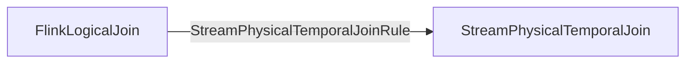
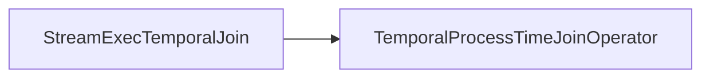
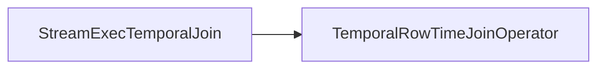

### Required &  Provided Change Log Mode
#### SatisfyModifyKindSetTraitVisitor
```Java
case temporalJoin: StreamPhysicalTemporalJoin =>  
  // currently, temporal join supports all kings of changes, including right side  
  val children = visitChildren(temporalJoin, ModifyKindSetTrait.ALL_CHANGES)  
  // forward left input changes
  // provided和左表的ModifyKindSetTrait保持一致
  val leftTrait = children.head.getTraitSet.getTrait(ModifyKindSetTraitDef.INSTANCE)  
  createNewNode(temporalJoin, children, leftTrait, requiredTrait, requester)
```
#### SatisfyUpdateKindTraitVisitor
```Java
case temporalJoin: StreamPhysicalTemporalJoin =>  
  val left = temporalJoin.getLeft.asInstanceOf[StreamPhysicalRel]  
  val right = temporalJoin.getRight.asInstanceOf[StreamPhysicalRel]  
  
  // the left input required trait depends on it's parent in temporal join  
  // the left input will send message to parent  
  val requiredUpdateBeforeByParent = requiredTrait.updateKind == UpdateKind.BEFORE_AND_AFTER  
  val leftInputModifyKindSet = getModifyKindSet(left)  
  val leftRequiredTrait = if (requiredUpdateBeforeByParent) {
	// 如果左表provided包含update，那么就是update before and after,不包含就是None  
    beforeAfterOrNone(leftInputModifyKindSet)  
  } else {  
    onlyAfterOrNone(leftInputModifyKindSet)  
  }  
  val newLeftOption = this.visit(left, leftRequiredTrait)  
  
  val rightInputModifyKindSet = getModifyKindSet(right)  
  // currently temporal join support changelog stream as the right side  
  // so it supports both ONLY_AFTER and BEFORE_AFTER, but prefer ONLY_AFTER  
  val newRightOption = this.visit(right, onlyAfterOrNone(rightInputModifyKindSet)) match {  
    case Some(newRight) => Some(newRight)  
    case None =>  
      val beforeAfter = beforeAfterOrNone(rightInputModifyKindSet)  
      this.visit(right, beforeAfter)  
  }  
  
  (newLeftOption, newRightOption) match {  
    case (Some(newLeft), Some(newRight)) =>  
      val leftTrait = newLeft.getTraitSet.getTrait(UpdateKindTraitDef.INSTANCE) 
      // provided和左表一致 
      createNewNode(temporalJoin, Some(List(newLeft, newRight)), leftTrait)  
    case _ =>  
      None  
  }
```
#### UpdateKindTrait
```Java
def beforeAfterOrNone(modifyKindSet: ModifyKindSet): UpdateKindTrait = {  
  val updateKind = if (modifyKindSet.contains(ModifyKind.UPDATE)) {  
    UpdateKind.BEFORE_AND_AFTER  
  } else {  
    UpdateKind.NONE  
  }  
  new UpdateKindTrait(updateKind)  
}

def onlyAfterOrNone(modifyKindSet: ModifyKindSet): UpdateKindTrait = {  
  val updateKind = if (modifyKindSet.contains(ModifyKind.UPDATE)) {  
    UpdateKind.ONLY_UPDATE_AFTER  
  } else {  
    UpdateKind.NONE  
  }  
  new UpdateKindTrait(updateKind)  
}
```
### Logic & Physical Plan & Execution

#### Physical Logical Optimized

#### Transform to Exec Plan

#### Stream Operator
- Processing Time

- Event Time


## Limitation
#### Temporal Table Function Join
```Java
// TemporalJoinUtil.class
def isTemporalFunctionJoin(rexBuilder: RexBuilder, joinInfo: JoinInfo): Boolean = {  
  val nonEquiJoinRex = joinInfo.getRemaining(rexBuilder)  
  var isTemporalFunctionJoin: Boolean = false  
  val visitor = new RexVisitorImpl[Unit](true) {  
    override def visitCall(call: RexCall): Unit = {  
      if (isTemporalFunctionCon(call)) {  
        isTemporalFunctionJoin = true  
      } else {  
        super.visitCall(call)  
      }  
    }  
  }  
  nonEquiJoinRex.accept(visitor)  
  isTemporalFunctionJoin  
}  
  
def isTemporalFunctionCon(rexCall: RexCall): Boolean = {  
  // (LEFT_TIME_ATTRIBUTE, PRIMARY_KEY) - processing time
  // (LEFT_TIME_ATTRIBUTE, RIGHT_TIME_ATTRIBUTE, PRIMARY_KEY)  - event time
  rexCall.getOperator == TEMPORAL_JOIN_CONDITION &&  
  (rexCall.operands.length == 2 || rexCall.operands.length == 3)  
}

def isRowTimeTemporalFunctionJoinCon(rexCall: RexCall): Boolean = {  
  // (LEFT_TIME_ATTRIBUTE, RIGHT_TIME_ATTRIBUTE, PRIMARY_KEY)  
  rexCall.getOperator == TEMPORAL_JOIN_CONDITION && rexCall.operands.length == 3  
}

val TEMPORAL_JOIN_CONDITION = new SqlFunction(  
  "__TEMPORAL_JOIN_CONDITION",  
  SqlKind.OTHER_FUNCTION,  
  ReturnTypes.BOOLEAN_NOT_NULL,  
  null,  
  OperandTypes.or(  
    /** ------------------------ Temporal table join condition ------------------------* */  
    // right time attribute and primary key are required in event-time temporal table join,    OperandTypes.sequence(  
      "'(LEFT_TIME_ATTRIBUTE, RIGHT_TIME_ATTRIBUTE, PRIMARY_KEY, LEFT_KEY, RIGHT_KEY)'",  
      OperandTypes.DATETIME,  
      OperandTypes.DATETIME,  
      OperandTypes.ANY,  
      OperandTypes.ANY,  
      OperandTypes.ANY  
    ),  
    // right primary key is required for processing-time temporal table join  
    OperandTypes.sequence(  
      "'(LEFT_TIME_ATTRIBUTE, PRIMARY_KEY, LEFT_KEY, RIGHT_KEY)'",  
      OperandTypes.DATETIME,  
      OperandTypes.ANY,  
      OperandTypes.ANY,  
      OperandTypes.ANY),  
    /** ------------------ Temporal table function join condition ---------------------* */  
    // Event-time temporal function join condition    OperandTypes.sequence(  
      "'(LEFT_TIME_ATTRIBUTE, RIGHT_TIME_ATTRIBUTE, PRIMARY_KEY)'",  
      OperandTypes.DATETIME,  
      OperandTypes.DATETIME,  
      OperandTypes.ANY),  
    // Processing-time temporal function join condition  
    OperandTypes.sequence(  
      "'(LEFT_TIME_ATTRIBUTE, PRIMARY_KEY)'",  
      OperandTypes.DATETIME,  
      OperandTypes.ANY)  
  ),  
  SqlFunctionCategory.SYSTEM)
```
1. 左表有时间属性, 右表不一定，这里有个问号？？？但是从temporal table function的定义来看，一定要指定一个时间属性和主键
2. 右表有主键
3. 只支持inner join
4. 只支持单个primary key
5. 至少有一个等值join条件
#### Temporal Table Join
```Java
// TemporalTableJoinUtil.class
public static boolean isRowTimeTemporalTableJoinCondition(RexCall call) {  
    // (LEFT_TIME_ATTRIBUTE, RIGHT_TIME_ATTRIBUTE, LEFT_KEY, RIGHT_KEY, PRIMARY_KEY)  
    return call.getOperator() == TemporalJoinUtil.TEMPORAL_JOIN_CONDITION()  
            && call.operands.size() == 5;  
}

// StreamExecTemporalJoin.class
if (isTemporalFunctionJoin) {  
    if (joinType != FlinkJoinType.INNER) {  
        throw new ValidationException(  
                "Temporal table function join currently only support INNER JOIN, "  
                        + "but was "  
                        + joinType  
                        + " JOIN.");  
    }  
} else {  
    if (joinType != FlinkJoinType.LEFT && joinType != FlinkJoinType.INNER) {  
        throw new TableException(  
                "Temporal table join currently only support INNER JOIN and LEFT JOIN, "  
                        + "but was "  
                        + joinType  
                        + " JOIN.");  
    }  
}
```
1. 左边和右表要有时间属性
2. 右边有主键
3. join条件中包含主键
4. 不支持processing time
5. 只支持inner join和left outer join
6. 至少有一个等值join条件
## 核心逻辑
### TemporalProcessTimeJoinOperator
```Java
// 处理左表数据
public void processElement1(StreamRecord<RowData> element) throws Exception {  
    RowData leftSideRow = element.getValue();
    // 根据左表的Key去状态中拿对应的value state
    RowData rightSideRow = rightState.value();  
  
    if (rightSideRow == null) {  
        if (isLeftOuterJoin) {
	        // 这个对于processing time，永远走不到，因为目前不支持  
            collectJoinedRow(leftSideRow, rightNullRow);  
        } else {  
            return;  
        }  
    } else {  
        if (joinCondition.apply(leftSideRow, rightSideRow)) {  
            collectJoinedRow(leftSideRow, rightSideRow);  
        } else {
		     // 这个对于processing time，永远走不到，因为目前不支持 
            if (isLeftOuterJoin) {  
                collectJoinedRow(leftSideRow, rightNullRow);  
            }  
        }  
        // register a cleanup timer only if the rightSideRow is not null
        // 我的理解是，这个状态被访问了一次，就要延迟清理时间  
        registerProcessingCleanupTimer();  
    }}

// 处理右表数据
public void processElement2(StreamRecord<RowData> element) throws Exception {  
    if (RowDataUtil.isAccumulateMsg(element.getValue())) {  
        rightState.update(element.getValue());  
        // 右边有新的数据来，就更新timer时间，延长数据的保留时间  
        registerProcessingCleanupTimer();  
    } else {  
        rightState.clear();  
        // 删除上一次的timer  
        cleanupLastTimer();  
    }}
```

### TemporalRowTimeJoinOperator

> [!NOTE]
> 1. 右表就算有回撤消息，就算和左表join上了，最后发出去的RowKind也是和左表的一致；
> 2. 当触发写出后，小于当前watermark的左右表数据都要删除；
> 3. 当触发写出后，在缓存中只保留元素最新版本，过期版本将删除。

#### 图解
![[Event Time Temporal Join图解.png]]
#### 几个重要的state
```Java
/** Incremental index generator for {@link #leftState}'s keys. */  
private transient ValueState<Long> nextLeftIndex;  
  
/**  
 * Mapping from artificial row index (generated by `nextLeftIndex`) into the left side `Row`. 
 * We can not use List to accumulate Rows, because we need efficient deletes of the oldest rows.  
 * <p>TODO: this could be OrderedMultiMap[Jlong, Row] indexed by row's timestamp, to avoid full  
 * map traversals (if we have lots of rows on the state that exceed `currentWatermark`).  
 */
 // 存储左表的数据，大于watermark的数据，key为自增索引，value为数据本身
 // 用index就是为了后面更快地删除state里面的数据，如果用timestamp的话，会增加排序的开销
 private transient MapState<Long, RowData> leftState;  
  
/**  
 * Mapping from timestamp to right side `Row`. 
 * <p>TODO: having `rightState` as an OrderedMapState would allow us to avoid sorting cost once per watermark  
 */
 // 存储右表的数据，key为数据的timestamp,value是数据本身
 private transient MapState<Long, RowData> rightState;  
  
// Long for correct handling of default null  
private transient ValueState<Long> registeredTimer;
```
#### processElement1()
```Java
public void processElement1(StreamRecord<RowData> element) throws Exception {  
    RowData row = element.getValue();  
    leftState.put(getNextLeftIndex(), row);  
    registerSmallestTimer(getLeftTime(row)); // Timer to emit and clean up the state  
  
    registerProcessingCleanupTimer();  
}
```
#### processElement2()
```Java
public void processElement2(StreamRecord<RowData> element) throws Exception {  
    RowData row = element.getValue();  
  
    long rowTime = getRightTime(row);  
    rightState.put(rowTime, row);  
    registerSmallestTimer(rowTime); // Timer to clean up the state  
  
    registerProcessingCleanupTimer();  
}
```
#### onEventTime()
```Java
public void onEventTime(InternalTimer<Object, VoidNamespace> timer) throws Exception {  
    registeredTimer.clear();  
    long lastUnprocessedTime = emitResultAndCleanUpState(timerService.currentWatermark());  
    if (lastUnprocessedTime < Long.MAX_VALUE) {  
  
        // 重新注册新的timer，用当前还未处理数据的最小时间  
        registerTimer(lastUnprocessedTime);  
    }  
    // if we have more state at any side, then update the timer, else clean it up.  
    if (stateCleaningEnabled) {  
        if (lastUnprocessedTime < Long.MAX_VALUE || !rightState.isEmpty()) {  
            registerProcessingCleanupTimer();  
        } else {  
            // 如果上游没有数据了，或者右表没有数据了，就删除timer，并清理state里面的index  
            // right state在这里不可能为空，因为能走到onEventTime,  
            // 说明左右表都有大于或者等于当前watermark的数据，说明right state里面有数据  
            cleanupLastTimer();  
            nextLeftIndex.clear();  
        }  
    }  
}
```
#### emitResultAndCleanUpState()
```Java
private long emitResultAndCleanUpState(long currentWatermark) throws Exception {  
    // 将右表的数据按时间升序排序  
    List<RowData> rightRowsSorted = getRightRowSorted(rightRowtimeComparator);  
    long lastUnprocessedTime = Long.MAX_VALUE;  
  
    Iterator<Map.Entry<Long, RowData>> leftIterator = leftState.entries().iterator();  
    // the output records' order should keep same with left input records arrival order  
    final Map<Long, RowData> orderedLeftRecords = new TreeMap<>();  
  
    while (leftIterator.hasNext()) {  
        Map.Entry<Long, RowData> entry = leftIterator.next();  
        Long leftSeq = entry.getKey();  
        RowData leftRow = entry.getValue();  
        long leftTime = getLeftTime(leftRow);  
        if (leftTime <= currentWatermark) {  
            // 将小于当前watermark的数据放入orderedLeftRecords中，并将state中的数据删除  
            orderedLeftRecords.put(leftSeq, leftRow);  
            leftIterator.remove();  
        } else {  
            // 计算最小的未处理的时间  
            lastUnprocessedTime = Math.min(lastUnprocessedTime, leftTime);  
        }  
    }  
  
    // iterate the triggered left records in the ascending order of the sequence key, i.e. the  
    // arrival order.    
    orderedLeftRecords.forEach(  
            (leftSeq, leftRow) -> {  
                long leftTime = getLeftTime(leftRow);  
                // 二分查找右表中最接近左表时间的数据  
                Optional<RowData> rightRow = latestRightRowToJoin(rightRowsSorted, leftTime);  
                if (rightRow.isPresent() && RowDataUtil.isAccumulateMsg(rightRow.get())) {  
                    if (joinCondition.apply(leftRow, rightRow.get())) {  
                        collectJoinedRow(leftRow, rightRow.get());  
                    } else {  
                        if (isLeftOuterJoin) {  
                            collectJoinedRow(leftRow, rightNullRow);  
                        }  
                    }  
                } else {  
                    // 如果没查到数据或者数据不是accumulate类型的数据, inner join就不发出数据，left outer join发出null数据  
                    // 右表就算有回撤消息，就算和左表join上了，最后发出去的RowKind也是和左表的一致  
                    if (isLeftOuterJoin) {  
                        collectJoinedRow(leftRow, rightNullRow);  
                    }  
                }  
            });  
    orderedLeftRecords.clear();  
  
    // 删除右表过期的数据  
    cleanupExpiredVersionInState(currentWatermark, rightRowsSorted);  
    return lastUnprocessedTime;  
}
```
#### latestRightRowToJoin()
```Java
/**  
 * Binary search {@code rightRowsSorted} to find the latest right row to join with {@code  
 * leftTime}. Latest means a right row with largest time that is still smaller or equal to  
 * {@code leftTime}. For example with: rightState = [1(+I), 4(+U), 7(+U), 9(-D), 12(I)],  
 * * <p>If left time is 6, the valid period should be [4, 7), data 4(+U) should be joined. 
 * * <p>If left time is 10, the valid period should be [9, 12), but data 9(-D) is a DELETE message 
 * which means the correspond version has no data in period [9, 12), data 9(-D) should not be 
 * correlated. 
 * @return found element or {@code Optional.empty} If such row was not found 
 * (either {@code rightRowsSorted} is empty or all {@code rightRowsSorted} are are newer).  
 */
private Optional<RowData> latestRightRowToJoin(List<RowData> rightRowsSorted, long leftTime) {  
    return latestRightRowToJoin(rightRowsSorted, 0, rightRowsSorted.size() - 1, leftTime);  
}  
  
private Optional<RowData> latestRightRowToJoin(  
        List<RowData> rightRowsSorted, int low, int high, long leftTime) {  
    if (low > high) {  
        // exact value not found, we are returning largest from the values smaller then leftTime  
        if (low - 1 < 0) {  
            return Optional.empty();  
        } else {  
            return Optional.of(rightRowsSorted.get(low - 1));  
        }  
    } else {  
        int mid = (low + high) >>> 1;  
        RowData midRow = rightRowsSorted.get(mid);  
        long midTime = getRightTime(midRow);  
        int cmp = Long.compare(midTime, leftTime);  
        if (cmp < 0) {  
            return latestRightRowToJoin(rightRowsSorted, mid + 1, high, leftTime);  
        } else if (cmp > 0) {  
            return latestRightRowToJoin(rightRowsSorted, low, mid - 1, leftTime);  
        } else {  
            return Optional.of(midRow);  
        }  
    }  
}
```
#### cleanupExpiredVersionInState()
```Java
private void cleanupExpiredVersionInState(long currentWatermark, List<RowData> rightRowsSorted)  
        throws Exception {  
    int i = 0;  
    // 找到右表要删除的数据  
    int indexToKeep = firstIndexToKeep(currentWatermark, rightRowsSorted);  
    // clean old version data that behind current watermark  
    while (i < indexToKeep) {  
        long rightTime = getRightTime(rightRowsSorted.get(i));  
        rightState.remove(rightTime);  
        i += 1;  
    }}
```

#### firstIndexToKeep() & indexOfFirstElementNewerThanTimer()
```Java
private int firstIndexToKeep(long timerTimestamp, List<RowData> rightRowsSorted) {  
    int firstIndexNewerThenTimer =  
            indexOfFirstElementNewerThanTimer(timerTimestamp, rightRowsSorted);  
  
    if (firstIndexNewerThenTimer < 0) {  
        // 如果返回-1，意味着所有数据的时间戳都小于timerTimestamp，所以要保留所有数据  
        return rightRowsSorted.size() - 1;  
    } else {  
        // 如果返回3，意味着前三个数据的时间戳都小于timerTimestamp，所以要保留第四个数据  
        return firstIndexNewerThenTimer - 1;  
    }}  
  
private int indexOfFirstElementNewerThanTimer(long timerTimestamp, List<RowData> list) {  
    ListIterator<RowData> iter = list.listIterator();  
    while (iter.hasNext()) {  
        if (getRightTime(iter.next()) > timerTimestamp) {  
            return iter.previousIndex();  
        }  
    }  
    return -1;  
}
```
### Resources
1. [[Change Log 原理与实现]]
2. [[Stream SQL Temporal Join Example]]
3. [[Join Use Case]]
4. https://blog.csdn.net/bluishglc/article/details/136707197 - Temporal Join详细介绍
5. https://blog.csdn.net/bluishglc/article/details/136429829?ops_request_misc=%257B%2522request%255Fid%2522%253A%2522171263865816800215068050%2522%252C%2522scm%2522%253A%252220140713.130102334.pc%255Fblog.%2522%257D&request_id=171263865816800215068050&biz_id=0&utm_medium=distribute.pc_search_result.none-task-blog-2~blog~first_rank_ecpm_v1~times_rank-10-136429829-null-null.nonecase&utm_term=temporal%20join&spm=1018.2226.3001.4450 - Temporal Table Join & Temporal Table Function Join
6. https://blog.csdn.net/bluishglc/article/details/136853480?ops_request_misc=%257B%2522request%255Fid%2522%253A%2522171263865816800215068050%2522%252C%2522scm%2522%253A%252220140713.130102334.pc%255Fblog.%2522%257D&request_id=171263865816800215068050&biz_id=0&utm_medium=distribute.pc_search_result.none-task-blog-2~blog~first_rank_ecpm_v1~times_rank-2-136853480-null-null.nonecase&utm_term=temporal%20join&spm=1018.2226.3001.4450 - Look up join 与 Temporal join区别
7. https://blog.csdn.net/bluishglc/article/details/136939415?ops_request_misc=%257B%2522request%255Fid%2522%253A%2522171263865816800215068050%2522%252C%2522scm%2522%253A%252220140713.130102334.pc%255Fblog.%2522%257D&request_id=171263865816800215068050&biz_id=0&utm_medium=distribute.pc_search_result.none-task-blog-2~blog~first_rank_ecpm_v1~times_rank-1-136939415-null-null.nonecase&utm_term=temporal%20join&spm=1018.2226.3001.4450 - 维表join的技术难点和实现方案
8. https://nightlies.apache.org/flink/flink-docs-release-1.16/docs/dev/table/concepts/temporal_table_function/
9. https://nightlies.apache.org/flink/flink-docs-release-1.16/docs/dev/table/concepts/versioned_tables/
10. https://blog.csdn.net/u013411339/article/details/88840356 - Temporal Join Event Time
11. https://www.jianshu.com/p/a83436cb04cf - Event Time Temporal Table Join 源码分析