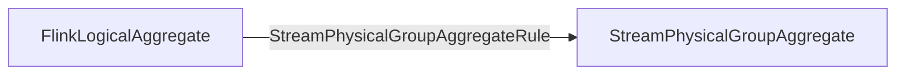
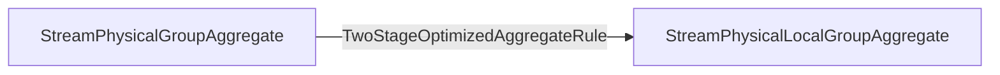
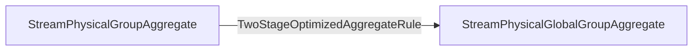
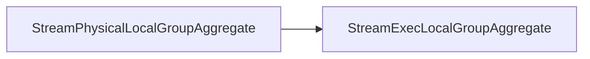
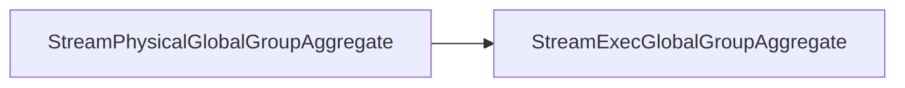
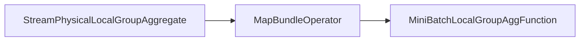
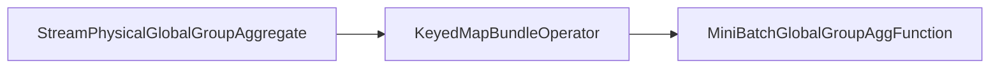

## Logic & Physical Plan & Execution
### Physical Logical Optimized
- group aggregate

- local aggregate

- global aggregate

### Transform to Exec Plan
- local aggregate

- global aggregate

### Stream Operator
- local aggregate

- global aggregate

## Limitation
1. mini-batch is enabled in given TableConfig
```Java
val isMiniBatchEnabled = tableConfig.get(ExecutionConfigOptions.TABLE_EXEC_MINIBATCH_ENABLED)
```
2. two-phase aggregation is enabled in given TableConfig
```Java
val isTwoPhaseEnabled = getAggPhaseStrategy(tableConfig) != AggregatePhaseStrategy.ONE_PHASE
```
3. all aggregate functions are mergeable
```Java
// TwoStageOptimizedAggregateRule.class
AggregateUtil.doAllSupportPartialMerge(aggInfoList.aggInfos)

// AggregateUtil.class
/** Return true if all aggregates can be partially merged. False otherwise. */  
def doAllSupportPartialMerge(aggInfos: Array[AggregateInfo]): Boolean = {  
  val supportMerge = aggInfos.map(_.function).forall {  
    case _: DeclarativeAggregateFunction => true  
    case a => ifMethodExistInFunction("merge", a)  
  }  
  // it means grouping without aggregate functions  
  aggInfos.isEmpty || supportMerge  
}
```
4. the input of exchange does not satisfy the shuffle distribution
```Java
!isInputSatisfyRequiredDistribution(realInput, agg.grouping)

private def isInputSatisfyRequiredDistribution(input: RelNode, keys: Array[Int]): Boolean = {  
  val requiredDistribution = createDistribution(keys)  
  val inputDistribution = input.getTraitSet.getTrait(FlinkRelDistributionTraitDef.INSTANCE)  
  inputDistribution.satisfies(requiredDistribution)  
}
```
## 核心逻辑
### MiniBatchLocalGroupAggFunction
#### addInput()
```Java
public RowData addInput(@Nullable RowData previousAcc, RowData input) throws Exception {  
    RowData currentAcc;  
    if (previousAcc == null) {  
        currentAcc = function.createAccumulators();  
    } else {  
        currentAcc = previousAcc;  
    }    
    function.setAccumulators(currentAcc);  
    if (isAccumulateMsg(input)) {  
        function.accumulate(input);  
    } else {  
        function.retract(input);  
    }    
    // return the updated accumulators  
    return function.getAccumulators();  
}
```
#### finishBundle()
```Java
public void finishBundle(Map<RowData, RowData> buffer, Collector<RowData> out)  
        throws Exception {  
    for (Map.Entry<RowData, RowData> entry : buffer.entrySet()) {  
        RowData currentKey = entry.getKey();  
        RowData currentAcc = entry.getValue();  
        resultRow.replace(currentKey, currentAcc);  
        out.collect(resultRow);  
    }    
    buffer.clear();  
}
```
### MiniBatchGlobalGroupAggFunction
#### addInput()
```Java
/**  
 * The {@code previousAcc} is accumulator,
 * but input is a row in <key, accumulator> schema,
 * the specific generated {@link #localAgg} will project the {@code input} to  
 * accumulator in merge method. 
 */
public RowData addInput(@Nullable RowData previousAcc, RowData input) throws Exception {  
    RowData currentAcc;  
    if (previousAcc == null) {  
        currentAcc = localAgg.createAccumulators();  
    } else {  
        currentAcc = previousAcc;  
    }  
    localAgg.setAccumulators(currentAcc); 
    // 合并accumulators 
    localAgg.merge(input);  
    return localAgg.getAccumulators();  
}
```
#### finishBundle()
```Java
public void finishBundle(Map<RowData, RowData> buffer, Collector<RowData> out)  
        throws Exception {  
    for (Map.Entry<RowData, RowData> entry : buffer.entrySet()) {  
        RowData currentKey = entry.getKey();  
        RowData bufferAcc = entry.getValue();  
  
        boolean firstRow = false;  
  
        // set current key to access states under the current key  
        ctx.setCurrentKey(currentKey);  
        RowData stateAcc = accState.value();  
        if (stateAcc == null) {  
            stateAcc = globalAgg.createAccumulators();  
            firstRow = true;  
        }  
        // set accumulator first  
        globalAgg.setAccumulators(stateAcc);  
        // get previous aggregate result  
        RowData prevAggValue = globalAgg.getValue();  
  
        // merge bufferAcc to stateAcc  
        globalAgg.merge(bufferAcc);  
        // get current aggregate result  
        RowData newAggValue = globalAgg.getValue();  
        // get new accumulator  
        stateAcc = globalAgg.getAccumulators();  
  
        if (!recordCounter.recordCountIsZero(stateAcc)) {  
            // we aggregated at least one record for this key  
  
            // update acc to state            
            accState.update(stateAcc);  
  
            // if this was not the first row and we have to emit retractions  
            if (!firstRow) {  
                if (!equaliser.equals(prevAggValue, newAggValue)) {  
                    // new row is not same with prev row  
                    if (generateUpdateBefore) {  
                        // prepare UPDATE_BEFORE message for previous row  
                        resultRow  
                                .replace(currentKey, prevAggValue)  
                                .setRowKind(RowKind.UPDATE_BEFORE);  
                        out.collect(resultRow);  
                    }  
                    // prepare UPDATE_AFTER message for new row  
                    resultRow.replace(currentKey, newAggValue).setRowKind(RowKind.UPDATE_AFTER);  
                    out.collect(resultRow);  
                }  
                // new row is same with prev row, no need to output  
            } else {  
                // this is the first, output new result  
                // prepare INSERT message for new row                
                resultRow.replace(currentKey, newAggValue).setRowKind(RowKind.INSERT);  
                out.collect(resultRow);  
            }  
  
        } else {  
            // we retracted the last record for this key  
            // sent out a delete message            
            if (!firstRow) {  
                // prepare DELETE message for previous row  
                resultRow.replace(currentKey, prevAggValue).setRowKind(RowKind.DELETE);  
                out.collect(resultRow);  
            }  
            // and clear all state  
            accState.clear();  
            // cleanup dataview under current key  
            globalAgg.cleanup();  
        }  
    }  
}
```
## Resources
1. [[Mini-Batch Group Aggregate]]
2. [[Local-Global Group Aggregate Example]]
3. [Flink sql 之 两阶段聚合与 TwoStageOptimizedAggregateRule（源码分析） - ljygz - 博客园 (cnblogs.com)](https://www.cnblogs.com/ljygz/p/15771889.html)