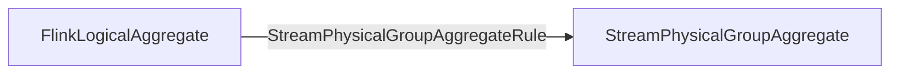
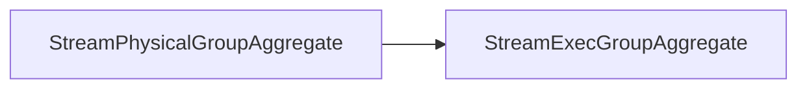
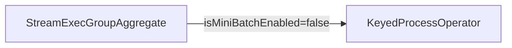
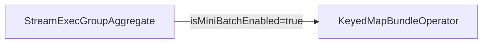

## Logic & Physical Plan & Execution
### Physical Logical Optimized

### Transform to Exec Plan

### Stream Operator
- regular

- mini-batch

## 核心逻辑
### AbstractMapBundleOperator
#### 类关系图
![[AbstractMapBundleOperator Diagram.png]]
#### 几个重要的实例变量
```Java
/** The map in heap to store elements. */  
// 存储每个key对应的数据
private transient Map<K, V> bundle;  
  
/** The trigger that determines how many elements should be put into a bundle. */ 
// mini batch count trigger
private final BundleTrigger<IN> bundleTrigger;  
  
/** The function used to process when receiving element. */
// 处理数据的function，这里就是MiniBatchGroupAggFunction
private final MapBundleFunction<K, V, IN, OUT> function;
```
#### processElement()
```Java
public void processElement(StreamRecord<IN> element) throws Exception {  
    // get the key and value for the map bundle  
    final IN input = element.getValue();  
    final K bundleKey = getKey(input);  
    final V bundleValue = bundle.get(bundleKey);  
  
    // get a new value after adding this element to bundle  
    final V newBundleValue = function.addInput(bundleValue, input);  
  
    // update to map bundle  
    bundle.put(bundleKey, newBundleValue);  
  
    numOfElements++;  
    bundleTrigger.onElement(input);  
}
```
#### finishBundle()
```Java
// emit acc
public void finishBundle() throws Exception {  
    if (bundle != null && !bundle.isEmpty()) {  
        numOfElements = 0;  
        function.finishBundle(bundle, collector);  
        bundle.clear();  
    }    
    bundleTrigger.reset();  
}
```
#### processWatermark()
```Java
public void processWatermark(Watermark mark) throws Exception {  
	// watermark来了，也要处理数据，发送聚合结果
    finishBundle();  
    super.processWatermark(mark);  
}
```
### MiniBatchGroupAggFunction
#### 类关系图
![[MapBundleFunction Diagram.png]]
#### addInput()
```Java
public List<RowData> addInput(@Nullable List<RowData> value, RowData input) throws Exception {  
    List<RowData> bufferedRows = value;  
    if (value == null) {  
        bufferedRows = new ArrayList<>();  
    }    
    // input row maybe reused, we need deep copy here  
    bufferedRows.add(inputRowSerializer.copy(input));  
    return bufferedRows;  
}
```
#### finishBundle()
```Java
public void finishBundle(Map<RowData, List<RowData>> buffer, Collector<RowData> out)  
        throws Exception {  
    for (Map.Entry<RowData, List<RowData>> entry : buffer.entrySet()) {  
        RowData currentKey = entry.getKey();  
        List<RowData> inputRows = entry.getValue();  
  
        boolean firstRow = false;  
  
        // step 1: get the accumulator for the current key  
        // set current key to access state under the key        
        ctx.setCurrentKey(currentKey);  
        RowData acc = accState.value();  
        if (acc == null) {  
        // Don't create a new accumulator for a retraction message. This  
	    // might happen if the retraction message is the first message for the
	    // key or after a state clean up.            
            Iterator<RowData> inputIter = inputRows.iterator();  
            while (inputIter.hasNext()) {  
                RowData current = inputIter.next();  
                if (isRetractMsg(current)) {
	                // remove all the beginning retraction messages   
                    inputIter.remove(); 
                } else {  
                    break;  
                }  
            }  
            if (inputRows.isEmpty()) {  
                return;  
            }  
            acc = function.createAccumulators();  
            firstRow = true;  
        }  
  
        // step 2: accumulate  
        function.setAccumulators(acc);  
  
        // get previous aggregate result  
        RowData prevAggValue = function.getValue();  
  
        for (RowData input : inputRows) {  
            if (isAccumulateMsg(input)) {  
                function.accumulate(input);  
            } else {  
                function.retract(input);  
            }  
        }  
  
        // get current aggregate result  
        RowData newAggValue = function.getValue();  
  
        // get updated accumulator  
        acc = function.getAccumulators();  
  
        if (!recordCounter.recordCountIsZero(acc)) {  
            // we aggregated at least one record for this key  
  
            // update acc to state            
            accState.update(acc);  
            // if this was not the first row and we have to emit retractions  
            if (!firstRow) {  
                if (!equaliser.equals(prevAggValue, newAggValue)) {  
                    // new row is not same with prev row  
                    if (generateUpdateBefore) {  
                        // prepare UPDATE_BEFORE message for previous row  
                        resultRow  
                                .replace(currentKey, prevAggValue)  
                                .setRowKind(RowKind.UPDATE_BEFORE);  
                        out.collect(resultRow);  
                    }  
                    // prepare UPDATE_AFTER message for new row  
                    resultRow.replace(currentKey, newAggValue).setRowKind(RowKind.UPDATE_AFTER);  
                    out.collect(resultRow);  
                }  
                // new row is same with prev row, no need to output  
            } else {  
                // this is the first, output new result  
                // prepare INSERT message for new row                
                resultRow.replace(currentKey, newAggValue).setRowKind(RowKind.INSERT);  
                out.collect(resultRow);  
            }  
  
        } else {  
            // we retracted the last record for this key  
            // if this is not first row sent out a DELETE message            
            if (!firstRow) {  
                // prepare DELETE message for previous row  
                resultRow.replace(currentKey, prevAggValue).setRowKind(RowKind.DELETE);  
                out.collect(resultRow);  
            }  
            // and clear all state  
            accState.clear();  
            // cleanup dataview under current key  
            function.cleanup();  
        }  
    }  
}
```

### BundleTrigger
#### 类关系图
![[Mini Batch - Buddle Trigger Diagram.png]]
### CountBundleTrigger
#### onElement()
```Java
public void onElement(T element) throws Exception {  
    count++;  
    if (count >= maxCount) {  
        callback.finishBundle();  
        reset();  
    }}
```
## Resources
1. [[Group Aggregate]]
2. [[Mini-Batch Group Aggregate Example]]
3. [[Mini-Batch 核心概念以及基础类]]