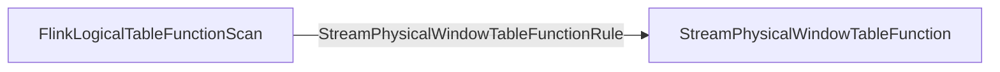
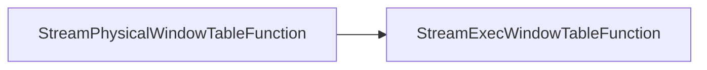
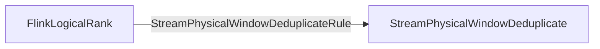
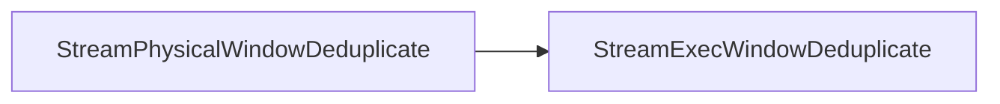

## Required Change Log Mode
- required `ModifyKindSetTrait` - INSERT_ONLY
- required `UpdateKindTrait` - NONE
## Required Time Attributes
- Event Time
- Sort Key is on time attributes
##  Required Rank Type
- ROW_NUMBER
- ConstantRankRange
- RankEnd = 1
---
## Logical & Physical Plan
### StreamExecWindowTableFunction
- Physical Logical Optimized

- Transform to Exec Plan


### StreamExecWindowDeduplicate

- Physical Logical Optimized

- Transform to Exec Plan


---
## 核心逻辑
- RowTimeDeduplicateRecordsCombiner
```Java
public void combine(WindowKey windowKey, Iterator<RowData> records) throws Exception {  
    // step 1: get first/last record of incremental data  
    RowData bufferedResult = null;  
    while (records.hasNext()) {  
        RowData record = records.next();  
        if (!isAccumulateMsg(record)) {  
            throw new UnsupportedOperationException(  
                    "Window deduplicate does not support input RowKind: "  
                            + record.getRowKind().shortString());  
        }  
        if (isDuplicate(bufferedResult, record, rowtimeIndex, keepLastRow)) {  
            // the incoming record is reused, we should copy it  
            bufferedResult = recordSerializer.copy(record);  
        }  
    }  
    if (bufferedResult == null) {  
        return;  
    }    // step 2: flush data into state  
    keyContext.setCurrentKey(windowKey.getKey());  
    Long window = windowKey.getWindow();  
    RowData preRow = dataState.value(window);  
    if (isDuplicate(preRow, bufferedResult, rowtimeIndex, keepLastRow)) {  
        dataState.update(window, bufferedResult);  
    }    // step 3: register timer for current window  
    timerService.registerEventTimeWindowTimer(window);  
}
```

- DeduplicateFunctionHelper
```Java
/** Returns current row is duplicate row or not compared to previous row. */  
public static boolean isDuplicate(  
        RowData preRow, RowData currentRow, int rowtimeIndex, boolean keepLastRow) {  
    if (keepLastRow) {  
        return preRow == null  
                || getRowtime(preRow, rowtimeIndex) <= getRowtime(currentRow, rowtimeIndex);  
    } else {  
        return preRow == null  
                || getRowtime(currentRow, rowtimeIndex) < getRowtime(preRow, rowtimeIndex);  
    }}
```