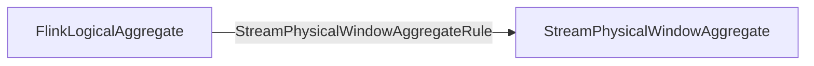

## Required Change Log Mode
- required `ModifyKindSetTrait` - INSERT_ONLY
- required `UpdateKindTrait` - NONE

## Logical & Physical Plan

- Physical Logical Optimized

- Transform to Exec Plan


## 核心逻辑
`StreamExecWindowAggregate.translateToPlanInternal(PlannerBase planner, ExecNodeConfig config)`
```Java
// create assigner based on windowingStrategy
final SliceAssigner sliceAssigner = createSliceAssigner(windowing, shiftTimeZone);

final OneInputStreamOperator<RowData, RowData> windowOperator =  
        SlicingWindowAggOperatorBuilder.builder()  
                .inputSerializer(new RowDataSerializer(inputRowType))  
                .shiftTimeZone(shiftTimeZone)  
                .keySerializer(  
                        (PagedTypeSerializer<RowData>)  
                                selector.getProducedType().toSerializer())  
                .assigner(sliceAssigner)  
                .countStarIndex(aggInfoList.getIndexOfCountStar())  
                .aggregate(generatedAggsHandler, new RowDataSerializer(accTypes))  
                .build();
```

`StreamExecWindowAggregateBase.createSliceAssigner(WindowingStrategy windowingStrategy, ZoneId shiftTimeZone)`
```Java
protected SliceAssigner createSliceAssigner(  
        WindowingStrategy windowingStrategy, ZoneId shiftTimeZone) {  
    WindowSpec windowSpec = windowingStrategy.getWindow();  
    if (windowingStrategy instanceof WindowAttachedWindowingStrategy) {  
        int windowEndIndex =  
                ((WindowAttachedWindowingStrategy) windowingStrategy).getWindowEnd();  
        // we don't need time attribute to assign windows, use a magic value in this case  
        SliceAssigner innerAssigner =  
                createSliceAssigner(windowSpec, Integer.MAX_VALUE, shiftTimeZone);  
        return SliceAssigners.windowed(windowEndIndex, innerAssigner);  
  
    } else if (windowingStrategy instanceof SliceAttachedWindowingStrategy) {  
        int sliceEndIndex = ((SliceAttachedWindowingStrategy) windowingStrategy).getSliceEnd();  
        // we don't need time attribute to assign windows, use a magic value in this case  
        SliceAssigner innerAssigner =  
                createSliceAssigner(windowSpec, Integer.MAX_VALUE, shiftTimeZone);  
        return SliceAssigners.sliced(sliceEndIndex, innerAssigner);  
  
    } else if (windowingStrategy instanceof TimeAttributeWindowingStrategy) {  
        final int timeAttributeIndex;  
        if (windowingStrategy.isRowtime()) {  
            timeAttributeIndex =  
                    ((TimeAttributeWindowingStrategy) windowingStrategy)  
                            .getTimeAttributeIndex();  
        } else {  
            timeAttributeIndex = -1;  
        }  
        return createSliceAssigner(windowSpec, timeAttributeIndex, shiftTimeZone);  
  
    } else {  
        throw new UnsupportedOperationException(windowingStrategy + " is not supported yet.");  
    }}
```

`SlicingWindowOperatorBuilder.build()`
```Java
public SlicingWindowOperator<RowData, ?> build() {  
    checkNotNull(assigner);  
    checkNotNull(inputSerializer);  
    checkNotNull(keySerializer);  
    checkNotNull(accSerializer);  
    checkNotNull(generatedAggregateFunction);  
  
    boolean isGlobalAgg =  
            localGeneratedAggregateFunction != null && globalGeneratedAggregateFunction != null;  
  
    RecordsCombiner.Factory combinerFactory;  
    if (isGlobalAgg) {  
        combinerFactory =  
                new GlobalAggCombiner.Factory(  
                        localGeneratedAggregateFunction, globalGeneratedAggregateFunction);  
    } else {  
        combinerFactory = new AggCombiner.Factory(generatedAggregateFunction);  
    }    final WindowBuffer.Factory bufferFactory =  
            new RecordsWindowBuffer.Factory(keySerializer, inputSerializer, combinerFactory);  
  
    final SlicingWindowProcessor<Long> windowProcessor;  
    if (assigner instanceof SliceSharedAssigner) {  
        windowProcessor =  
                new SliceSharedWindowAggProcessor(  
                        generatedAggregateFunction,  
                        bufferFactory,  
                        (SliceSharedAssigner) assigner,  
                        accSerializer,  
                        indexOfCountStart,  
                        shiftTimeZone);  
    } else if (assigner instanceof SliceUnsharedAssigner) {  
        windowProcessor =  
                new SliceUnsharedWindowAggProcessor(  
                        generatedAggregateFunction,  
                        bufferFactory,  
                        (SliceUnsharedAssigner) assigner,  
                        accSerializer,  
                        shiftTimeZone);  
    } else {  
        throw new IllegalArgumentException(  
                "assigner must be instance of SliceUnsharedAssigner or SliceSharedAssigner.");  
    }    return new SlicingWindowOperator<>(windowProcessor);  
}
```
## Resources
### 文档
1. [[Window Strategy]]
2. [[Slicing Window Operator]]
3. [[Slice Assigners]]
4. [[Slicing Window Processor]]
5. [[Records Combiner]]
6. [[Records Window Buffer]]
### 博客
1. https://zhuanlan.zhihu.com/p/461729847

