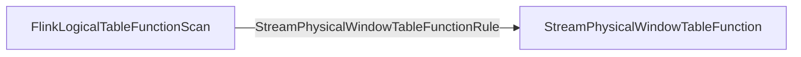

---

---
## Required Change Log Mode
- required `ModifyKindSetTrait` - INSERT_ONLY
- required `UpdateKindTrait` - NONE
## Required Time Attributes
- Event Time
##  Required Rank Type
- ROW_NUMBER
- ConstantRankRange
---
## Logical & Physical Plan
### StreamExecWindowTableFunction
- Physical Logical Optimized

- Transform to Exec Plan

### StreamExecWindowRank

- Physical Logical Optimized

- Transform to Exec Plan

---
## 核心逻辑
- TopNRecordsCombiner
```Java
public void combine(WindowKey windowKey, Iterator<RowData> records) throws Exception {  
    // step 1: load all incremental records into TopNBuffer  
    TopNBuffer buffer = new TopNBuffer(sortKeyComparator, ArrayList::new);  
    while (records.hasNext()) {  
        RowData record = records.next();  
        if (!isAccumulateMsg(record)) {  
            throw new UnsupportedOperationException(  
                    "Window rank does not support input RowKind: "  
                            + record.getRowKind().shortString());  
        }  
  
        RowData sortKey = sortKeySelector.getKey(record);  
        if (buffer.checkSortKeyInBufferRange(sortKey, topN)) {  
            // the incoming record is reused, we should copy it to insert into buffer  
            buffer.put(sortKey, recordSerializer.copy(record));  
        }  
    }  
  
    // step 2: flush data in TopNBuffer into state  
    Iterator<Map.Entry<RowData, Collection<RowData>>> bufferItr = buffer.entrySet().iterator();  
    keyContext.setCurrentKey(windowKey.getKey());  
    Long window = windowKey.getWindow();  
    while (bufferItr.hasNext()) {  
        Map.Entry<RowData, Collection<RowData>> entry = bufferItr.next();  
        RowData sortKey = entry.getKey();  
        List<RowData> existsData = dataState.get(window, sortKey);  
        if (existsData == null) {  
            existsData = new ArrayList<>();  
        }  
        existsData.addAll(entry.getValue());  
        dataState.put(window, sortKey, existsData);  
    }    // step 3: register timer for current window  
    if (isEventTime) {  
        timerService.registerEventTimeWindowTimer(window);  
    }    // we don't need register processing-time timer, because we already register them  
    // per-record in AbstractWindowAggProcessor.processElement()}  
```

- CommonExecWindowTableFunction - StreamExecWindowTableFunction
```Java
// create assigner
WindowAssigner<TimeWindow> windowAssigner = createWindowAssigner(windowingStrategy);  
// create operator
WindowTableFunctionOperator windowTableFunctionOperator =  
        new WindowTableFunctionOperator(  
                windowAssigner, windowingStrategy.getTimeAttributeIndex(), shiftTimeZone);
```

> [!WindowTableFunctionOperator]
> The operator acts as a table-valued function to assign windows for input row. Output row includes  
> the original columns as well additional 3 columns named window_start, window_end, window_time to 
> indicate the assigned window.
> 
> The operator emits result per record instead of at the end of window

```Java
 public void processElement(StreamRecord<RowData> element) throws Exception {  
    RowData inputRow = element.getValue();  
    long timestamp;  
    if (windowAssigner.isEventTime()) {  
        if (inputRow.isNullAt(rowtimeIndex)) {  
            // null timestamp would be dropped  
            return;  
        }  
        timestamp = inputRow.getTimestamp(rowtimeIndex, 3).getMillisecond();  
    } else {  
        timestamp = getProcessingTimeService().getCurrentProcessingTime();  
    }    timestamp = toUtcTimestampMills(timestamp, shiftTimeZone);  
    Collection<TimeWindow> elementWindows = windowAssigner.assignWindows(inputRow, timestamp);  
    for (TimeWindow window : elementWindows) {  
        windowProperties.setField(0, TimestampData.fromEpochMillis(window.getStart()));  
        windowProperties.setField(1, TimestampData.fromEpochMillis(window.getEnd()));  
        windowProperties.setField(  
                2,  
                TimestampData.fromEpochMillis(  
                        toEpochMills(window.maxTimestamp(), shiftTimeZone)));  
        collector.collect(outRow.replace(inputRow, windowProperties));  
    }}
```
